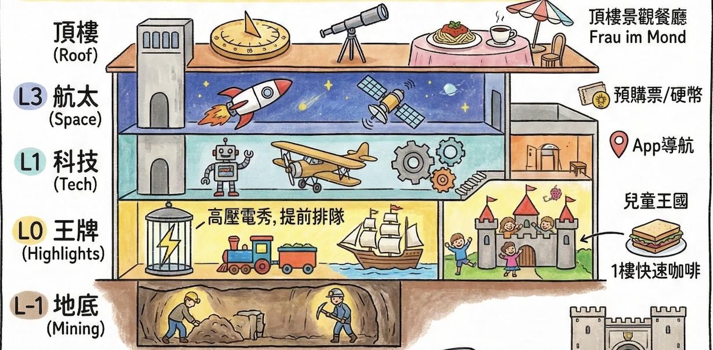

# 🏔️ 德國北義 每日行程規劃 (7/17 - 8/1)

## ✈️ 航班與座位資訊 (國泰航空 Cathay Pacific)

| 日期 | 航段 | 航班號 | 機型 | 起飛時間 | 抵達時間 | 劃位資訊 (共 4 位) |
| :--- | :--- | :--- | :--- | :--- | :--- | :--- |
| **2026/07/17** | 台北 (TPE) ➔ 香港 (HKG) | **CX479** | A350-900 | 21:05 | 23:05 | **42A, 42B, 42C, 42D** |
| **2026/07/18** | 香港 (HKG) ➔ 慕尼黑 (MUC) | **CX301** | A350-900 | 01:00 | 08:05 | **31H, 31K, 32H, 32K** |
| **2026/08/01** | 慕尼黑 (MUC) ➔ 香港 (HKG) | **CX300** | A350-900 | 13:05 | 06:50 (+1) | **17A, 18A, 18D, 18G** |
| **2026/08/02** | 香港 (HKG) ➔ 台北 (TPE) | **CX466** | A350-900 | 09:00 | 11:00 | **12A, 12D, 12G, 14A** |

## 🚗 SIXT 租車預訂總覽

**【基本資訊與取還車】**
| 項目 | 預訂細節 | 備註 |
| :--- | :--- | :--- |
| **預訂號碼** | **`9732518290`** | SIXT 預付帳單號：1001020002453101 |
| **主駕駛人** | **POYU HUANG** | 現場需出示：①護照 ②本國駕照 ③國際駕照 ④預訂信用卡(VISA 108) |
| **車輛組別** | **LFDR** | 例如：VW Touareg 或同級休旅車 |
| **預付總額** | **€ 1,522.81** | 已於 2026/4/4 透過 VISA 108 卡全額支付 |
| **現場押金** | **€ 500.00** | 取車時於信用卡凍結，還車後數日解除 |
| **取車資訊** | **7/18 (六) 10:30** | Munich Airport Terminalstr. Mitte/MWZ (取車寬限期 60 分鐘) |
| **還車資訊** | **8/01 (六) 10:30** | Munich Airport Terminalstr. Mitte/Parkhaus P6 (建議當日 09:00 提前抵達以預留退稅時間) |

**【已包含服務與保險細目 (已預付)】**
* **核心保障**：全險/竊盜險 (Vollkasko-/Diebstahlschutz)、最低自負額減免、第三方責任險
* **駕駛與乘客**：額外駕駛人 (Zusatzfahrer)、兒童增高座椅 (Kindersitzerhöhung)
* **車輛裝備**：跨境駕駛許可 (Cross-border driving)、全輪驅動 (All-wheel drive)、GPS 導航與連線功能
* **其他規費**：地點附加費、註冊費、24/7 故障協助 皆已含在總額中

> [!IMPORTANT]
> **✅ 待辦事項 (To-Do List)**
> - [ ] **行前準備**：出發前完成線上 Check-in (SIXT App)：出發前一週，下載 SIXT App 並登入您的訂單，提前把護照、國際駕照等資料拍照上傳完成「Online Check-in」，可大幅縮短當天現場人工核對證件與建檔的時間。
> - [ ] **行前準備 (7/15 ~ 7/17)**：填寫 **Travel to Europe App** (歐盟 EES 官方 App)：請於上飛機前 (抵達慕尼黑前 72 小時內即可) 事先為全家人輸入護照資料與入境問卷，過海關時出示 QR Code，能大幅省去海關現場打字與問話的時間。
>   * **📱 App 填寫通關小抄 (請照抄以下標準答案)**：
>     * **抵達航班 (Arrival Flight)**：`CX301`
>     * **離境航班 (Departure Flight)**：`CX300` (若需填寫回程)
>     * **旅遊目的 (Purpose of Stay)**：`Tourism` 或 `Holiday`
>     * **預計停留天數 (Duration of Stay)**：`15 days`
>     * **首晚住宿名稱 (Accommodation Name)**：`Residence Ciastel`
>     * **首晚住宿地址 (Address)**：`Str. Minert 2, I-39046 Ortisei in Val Gardena, Italy`
>     * **飯店電話 (Phone Number)**：`+39 0471 798288` (若 App 需填寫聯絡電話)
> - [ ] **7/18**：**抵達 Ortisei 飯店 Check-in 時，務必向櫃檯預約隔天早上的麵包配送 (Bread Delivery) 服務**，確保隔天一早有早餐可吃。
> - [ ] **7/18**：Val di Funes 停車場寄信給車牌（取車後務必在 **7/20 中午 12:00 前**發 email 至 `info@odlesdolomites.com` 更新真實車牌）。
> - [ ] **7/21**：Val di Funes [Parking Zans 停車場](https://www.odlesdolomites.com/en/parking-reservation/)預約（選 `Parking Zans` → `Car` → `7/21` → 最早時段 → 車牌先填 `AB000CD`）。最晚取車當天完成預約。
> - [x] **7/22**：**Rifugio Comici 午餐** ✅ 已訂位（12:00，4人）。
> - [ ] **7/15**：**Rifugio Comici 天氣確認** — 出發前一週查看 7/22 天氣預報，若預報下雨則提前寫信取消訂位（info@rifugiocomici.com），改執行 B 計畫（Rifugio Salei）。
> - [ ] **7/24**：晚餐地點尋找與安排（或確認自己煮）。
> - [ ] **7/25**：移動日晚餐尚未決定，應該要訂（抵達 Misurina 後，在米蘇里納湖畔找一間好餐廳）。
> - [ ] **7/26** 🔥：**Auronzo 三尖峰停車場預約 — 系統已於 4 月底開放，請立即至 [pass.auronzo.info](https://pass.auronzo.info) 搶購 `06:00–08:00` 時段！** 費用 €40／12 小時，出發前 5 天可全額退款，車牌最晚入場前一晚 23:59 補登。
> - [ ] **7/26**：晚餐地點尚未決定（三尖峰健行結束後，返回 Misurina 湖區周邊尋找餐廳）。
> - [ ] **7/27**：**大鐘山冰川公路門票**。⚠️ **必須等 7/18 拿到租車、確認車牌號碼後**，再至 [官網 Ticket Shop](https://grossglockner.at/gg/de/preiseundtickets) 購買並截圖 QR Code（或當天直接開到閘口刷卡買票亦可）。
> - [ ] **7/27**：**卡普倫 (Kaprun) 晚餐尚未安排**。預計當晚 18:10 抵達 Vötter's Hotel，需提早尋找附近餐廳並評估是否需要先訂位（或直接確認是否在飯店內用餐）。
> - [ ] **7/28**：**Ramsau 午餐地點尚未決定**。需提前尋找 Ramsau / Berchtesgaden 附近適合的午餐餐廳。
> - [ ] **7/28**：**晚上 Check-in 時請飯店將隔天早餐改成 Lunch Box 形式**（方便隔天早出發）。
> - [ ] **7/29** 🔥：**國王湖船票預購**，現在就買可省去現場排隊！至 **[shop-ks.seenschifffahrt.de](https://shop-ks.seenschifffahrt.de/?lang=en)** 選 **7/29 日期**，票種選「**Seelände → Salet 全程來回**」，出發時間選最早班 **08:15**。⚠️ 票券**不可退款、不可換日期**，確認天氣與行程後再下單。買完務必將 PDF 存到手機**離線資料夾**（國王湖附近手機訊號極差）。
> - [ ] **7/29**：**晚餐地點尚未決定**。需提前尋找 Schönau am Königssee 附近適合的晚餐餐廳（或確認能否在 St. Bartholomä 的 Fischerstüberl 餐廳下午就解決晚餐）。
> - [ ] **7/30**：**慕尼黑晚餐方式待決定**。選項 A：出外吃，推薦 **[Augustiner Klosterwirt](https://www.google.com/maps/search/?api=1&query=Augustiner+Klosterwirt+München)** 或 **[Ratskeller München（市政廳地窖）](https://www.google.com/maps/search/?api=1&query=Ratskeller+München)**（旺季建議提前確認是否需訂位）。選項 B：回飯店自己煮（Harry's Home 是公寓式酒店，房內有廚房設備，可在 Check-in 後順路至對面 Kaufland 超市採買食材）。
> - [ ] **7/30**：**耶拿峰纜車票**，可以考慮提前在 [官網](https://www.jennerbahn.de) 購票，到時候再決定。
> - [ ] **7/31** 🔥：**德意志博物館電子票預購**，於 **7月10日左右** (提前三週) 至 [官網售票頁面](https://tickets.deutsches-museum.de/) 購買指定時段門票 (Time-slot Ticket)，並備妥 1 歐元或 2 歐元硬幣供寄物櫃使用。
> - [ ] **7/31**：**晚餐安排**，找尋卡爾廣場周邊或亞洲菜餐廳（並確認是否需訂位）。
> - [ ] **8/1**：**退稅前置作業 (7/31 晚上)**，填妥所有退稅單據（簽名、護照、姓名、地址），並將要退稅的物品（如液體保養品、刀具）集中放進欲託運的行李箱。

根據您帶 7 歲小孩的腳程（成人 0.7 倍速）、喜歡寬敞安全步道、定時需要廁所與咖啡廳休息的習慣，我為您挑選了該區**最精華且最友善**的親子路線。

> [!CAUTION]
> **🚨 2026 年出行必修：強制預約與死線總整理 🚨**
> 根據最新限流政策，您的行程中有幾個核心景點及餐廳必須「強制事先預約」，否則將無法進入：
> 
> **🚗 交通與纜車限流預約**
> 1. **Seceda 纜車 (7/20)**：2026 年夏季開始實施**線上預約指定時段 (Time-slot)**（每半小時為一梯次限流）。根據官網最新公告，售票系統已於 **4 月份** 正式上線開放預約！請務必現在就上官網 [seceda.it](https://www.seceda.it) 搶下早晨黃金時段。
>    * **💳 買票戰略建議：** 2026 年成人來回票價高達 **70 歐元**。強烈建議您「**只買單程上山票 (One-way) 46.5 歐元**」！請特別注意：**訂票時系統會詢問目的地，請務必選擇「Seceda (山頂站)」，絕對不要只買到 Furnes (中繼站)**，否則還得自己爬超陡的上坡才能到刀鋒山！
>    * 搭配我們為您設計的「不走回頭路、純下坡」神級路線，直接走到另一頭的 Col Raiser 搭纜車下山（單程約 20 歐）。不僅總價更便宜，而且完全免除爬上坡的痛苦！

---

## ✈️ July 18 (六) 第一天：入境與跨國長征 (Arrival Day)
這天是星期六，正好逢歐洲暑假大連假出遊車潮的最佳塞車時段。加上今年起慕尼黑機場實施 **EES 新生物辨識通關** 所導致的大塞車，今天唯一的目標就是「安全、順利地把車開到義大利飯店」。

**⏳ 殘酷且真實的時程沙盤推演 (針對您 08:05 降落的國泰航空 CX301 班機)：**
* **`08:05 - 11:15`** **【海關地獄與 Family Lane 戰略】**：下飛機過 EES 海關、提領行李。
  * **🔥 衝刺戰略**：下飛機後「能走多快就走多快」！盡全力超越同班機的人潮，提早抵達查驗區。
  * **👨‍👩‍👧‍👦 Family Lane (家庭通道) 必用秘技**：由於 EES 新制上路，但 **12 歲以下兒童豁免按指紋**，無法使用自助機台。請抵達排隊區時，**直接尋找工作人員並表明有 7 歲小孩同行**，要求走 **Family Lane (家庭通道)** 去人工查驗櫃台。
  * **👨‍👩‍👧‍👦 全家同進退**：**所有同行大人請務必跟小孩走在一起通關！** 海關會將您們視為一個「同行家庭 (Traveling Party)」一起審查。小孩不需按指紋，大人則直接在人工櫃台完成指紋與拍照即可，這能幫全家人省下極大的排隊時間，千萬不要讓任何同行家人被拆散去排一般隊伍。
* **`11:15 - 12:45`** **【租車大戰】 (預訂時間 10:30, 緩衝期 60 分鐘)**：領完行李後前往慕尼黑機場 SIXT 櫃台 (Terminalstr. Mitte/MWZ)。
  * **🚗 租車憑證資訊**：SIXT 預訂編號 `9732518290`，主駕駛 `POYU HUANG`，預借車型 `LFDR` (VW Touareg 級別)。已含兒童增高墊、額外駕駛及跨境費，全險已付費。
  * **💡 必備文件 (不可放行李箱)**：抵達櫃台時主駕駛必須出示：① 預訂信用卡(VISA 108) ② 護照 ③ 台灣駕照正本 ④ 國際駕照。
  * **🏃 戰術建議**：抵達大廳後，主駕駛拿齊上述 4 樣文件「先空手衝去 SIXT 櫃台排隊抽號碼牌」，另一人帶小孩悠哉等行李再推車過去會合。
* **`12:45 - 17:45`** **【塞車長征與跨國收費】**：離開慕尼黑，行經奧地利，直達義大利 Ortisei。
  * **🗺️ 今日導航路線**：**[點此開啟含有 4 個推薦休息站的 Google Maps 路線](https://www.google.com/maps/dir/?api=1&origin=Munich+Airport+Terminal+1&destination=Residence+Ciastel,+Ortisei,+Italy&waypoints=Rastst%C3%A4tte+Irschenberg%7CInntal+Rastst%C3%A4tte%7CRaststation+Europabr%C3%BCcke%7CArea+di+servizio+Plose+Ovest)** (機場 -> 德國 A8 -> 奧地利 A12/A13 -> 義大利 A22 -> Ortisei)
  * **🚗 奧地利高速公路通行證 (Vignette)**：租車通常不含此證。離開德國邊境前，務必停靠休息站加油站（如 Irschenberg），購買「實體貼紙」貼在擋風玻璃左上角（約 10 歐元）。或拿到租車知道車牌後，立刻用手機上 [ASFINAG 官網](https://shop.asfinag.at) 買「1 日數位通行證 (1-Day Digital Vignette)」，立即生效免貼紙！
  * **💳 布倫納山口過路費 (Brenner Pass / A13)**：這是「不包含在 Vignette 內」的額外高山過路費！遇到收費站時排一般車道刷卡付費即可。**🔥 進階戰略**：知道車牌後，提前在 ASFINAG 官網加買「數位過路費 (Digital Section Toll)」。**購買路徑**：首頁選 `Digital Section Toll` ➔ 路線務必選 `A13 Brenner motorway` ➔ 買單程 `1 trip` ➔ 輸入車牌與國家 (德國)。過收費站時直接走綠色車道 (Video Toll / PKW Digital)，攝影機會掃車牌自動開柵欄，秒殺長長車陣！
  * **🇮🇹 義大利高速公路收費 (Autostrada)**：進入義大利 Vipiteno 收費站時，走白色通道「按鈕取票 (Biglietto)」。下 Chiusa 交流道時插入票卡，刷信用卡付費。
  * **💡 塞車預警**：正常車程 3.5 小時，但週六南下通常嚴重塞車，建議**抓 5 小時行車時間**。
* **`17:45 - 18:45`** **【中途休息與快速晚餐】**：此時台灣時間已經是半夜 12 點，司機與小孩肯定很睏了。**強烈建議這段長征途中，直接在義大利的 Autogrill 休息站把晚餐解決**（買熱狗堡、現烤帕尼尼），千萬別餓著肚子開夜路。
* **`18:45 - 19:45`** **【抵達飯店與秒躺平】**：抵達 Ortisei Residence Ciastel 辦理入住手續，卸下行李。**(⚠️ 記得向旅館結帳櫃檯預約隔天早上的麵包配送 Bread Delivery！)** 進房洗完澡大約晚上七、八點 (台灣時間半夜 1-2 點)，不需再出門，全家直接躺平一覺到天亮！
* **🚨 抵達 Ortisei 必備開車戰略（ZTL 特殊管制） 🚨**： 
  * Ortisei 小鎮於 2024 年 7 月起實施嚴格全天的 ZTL (Zona a Traffico Limitato) 限行區與攝影機科技執法。
  * **無腦跟導航必吃罰單**：進入 Ortisei 時請不要盲信 Google Maps，務必要抬頭看路邊的實體飯店指標，循著**「橘色路線 (Orange Hotel Route)」**行駛，才能避開禁行區。
  * **白名單保護傘**：拿到租車後，請務必第一時間寫 Email 給飯店您的**車牌號碼**，好讓他們幫您輸入當地系統申請免責授權，安心開進專屬停車場。
* **🔥 戰略隱藏優勢：維持台灣時差！** 這樣不僅讓司機徹底得到休息，隔天全家人更能精神百倍地在歐洲時間 **清晨 06:00** 輕鬆自然醒。這將直接成為您未來 5 天完美執行「早上出門包場步道、下午回飯店避開大雷雨」的**無敵外掛武器**！

**⛽ 沿途休息站推薦 (依照疲憊程度，可任選 1-2 處停靠)：**
1. **【開車 40 分鐘的絕美觀景台】Irschenberg (德國 A8)**
   * **特色：** 您聽說的完全正確！這個休息站位在半山腰上，擁有**毫無遮蔽的巴伐利亞阿爾卑斯山全景 (Panoramic View)**，被譽為德國最美的高速公路休息站之一。裡面有知名的 Dinzler 咖啡烘焙坊與麥當勞，非常適合一邊看山景、一邊喝杯頂級 Espresso 提神再上路。
2. **【開車 1.5 小時的必停站】Kufstein Süd / Inntal (德奧交界)**
   * **特色：** 剛進入奧地利境內。如果您租車時尚未購買**奧地利高速公路通行證 (Vignette)**，這是必停站！可以去加油站買貼紙，順便讓小孩下來走跳放風。
3. **【開車 2.5 小時的絕景中繼站】Europabrücke 歐洲橋休息站 (奧地利 A13)**
   * **特色：** 位於因斯布魯克 (Innsbruck) 附近，就在準備翻越阿爾卑斯山的最險要處。休息站旁邊就是壯觀的「歐洲大橋」，可以直接在那邊的餐廳看風景吃午餐，順便欣賞深谷。
4. **【開車 3.5 小時的首發義式體驗】Area di Servizio Plose Ovest (義大利 A22)**
   * **特色：** 這是下交流道前最後一個完美順向 (南下車道) 的義大利大型休息站。司機可以在這裡站著喝第一杯 1.5 歐元的超道地義大利 Espresso，點一份現烤的 帕尼尼 (Panini) 三明治當晚餐。

---

## 🌻 July 19 (日) 輕鬆暖身：休斯高原 (Alpe di Siusi)
**為何排在這天：** 週末避開車潮，從住宿直接走路去搭纜車！高原腹地極大，能完美稀釋週末人潮。
**🚗 交通 (從 Residence Ciastel 出發)：** 步行約 10 分鐘至 Mont Sëuc 纜車站，搭纜車直達山頂。**(不用開車)**。

**🥾 今日與鎮上可能行經步道總覽：** 

| 路線屬性 | 實際步道編號 (Trail) | 路線重點與終結點 |
| :--- | :--- | :--- |
| 輕鬆親子小環線 | `6A` ➡️ `6` ➡️ `6B` | 高原精華、Sanon 山屋 (吃午餐) |
| 體力好長征大環線 | `9` ➡️ `30` ➡️ `3` ➡️ `6B` | 谷底 Saltria、Rauchhütte、Sanon 山屋會合 |
| 進階岩石秘境線 | `6` ➡️ `7` ➡️ `8` | 遠離草皮，朝向 Rifugio Molignon (莫利農) |
| 全日大備案：女巫草甸 | `Trail 14` (Puflatsch / Bullaccia) | 需搭巴士至 Compatsch，去尋找奇岩「女巫長椅」 |
| 午後放電：大型遊樂場 | `Luis Trenker Promenade` (無編號) | 沿著舊鐵道遺跡的鎮上散步徑，直達木頭遊樂設施 |
| 午後放電/平地大備案 | `Trail 9` (Val d'Anna / 安娜谷) | 從纜車站旁出發的林蔭步道，推車可達，沿途滿是吊床 |

* **🎯 【終極同樂分流方案】：全家合體午餐 ＋ 午後各自放電 (完美克服時差早起)**
  因應時差早起，全家統一搭乘 **08:30 首班纜車**上山，並鎖定 11:30 於中繼點 **Sanon 山屋** 共同享用午餐，吃飽後兵分兩路！

  * **上半場：08:45 - 11:30 【全家合體漫步與早茶】**
    1. 所有人從 Mont Sëuc 出發，**一起走右側平緩的 Trail 6A 轉 6**。這段路毫無難度且無比開闊，以輕鬆組的小孩節奏緩步推進、拍合照。
    2. **09:30 必停早茶點**：中途經過 **[Malga Contrin (Contrin 山屋)](https://www.google.com/maps/search/?api=1&query=Malga+Contrin+Alpe+di+Siusi)**，這時候請立刻坐下，幫大家點熱可可跟蘋果捲。不僅能在清早取暖，還能完美填補五點起床提早發作的飢餓感，順便殺掉 45 分鐘！
    3. **11:00 抵達大會合點**：漫遊抵達 **[Malga Sanon (Sanon 山屋)](https://www.google.com/maps/search/?api=1&query=Malga+Sanon+Alpe+di+Siusi)**。讓小孩去衝向大草皮與動物遊具玩瘋，大人在陽光下放鬆。
    4. **11:30 - 12:30 Sanon 山屋午餐**：11:30 正好是國外餐廳剛開門的時間！全家人就在 Sanon 山屋的無敵美景前面對面享用烤肉、披薩與啤酒。

  * **下半場：12:30 吃飽後 【正式分流出發】**
    * **【輕鬆組 (帶小孩)】👉 下山回鎮上睡午覺／去遊樂場**
      小孩子吃飽後剛好想睡覺，這時候沿著左半邊的 **Trail 6B** (途中會經過 **[Schgaguler Schwaige](https://www.google.com/maps/search/?api=1&query=Schgaguler+Schwaige+Alpe+di+Siusi)**) 慢慢散步。大約 1 小時 (13:30) 就能走回纜車站，下午兩點可以舒服地躲回鎮上飯店睡午覺！
    * **【體力好的家人】👉 往腹地深處長征 (預計多走 3.5 - 4 小時)**
      獲得大量熱量後，把 Sanon 當作「新起點」！往西走 **Trail 3 切轉 Trail 30** (途中有機會路過超有名的 **[Rauchhütte](https://www.google.com/maps/search/?api=1&query=Rauchhütte+Alpe+di+Siusi)** 與 **[Gostner Schwaige](https://www.google.com/maps/search/?api=1&query=Gostner+Schwaige+Alpe+di+Siusi)**)，一路下切到 Saltria，再沿 **Trail 9** 爬長上坡回纜車站，約傍晚 16:30 返回鎮上。（若不走這圈，也可從 Sanon 走平行的 6 轉 7 去山谷裡的秘境 **[Rifugio Molignon](https://www.google.com/maps/search/?api=1&query=Rifugio+Molignon+Alpe+di+Siusi)**）。
* **🛝 午餐後鎮上放電行程 (Ortisei's Playground)**：中午回鎮上吃完飯後，超級推薦午後帶小孩去鎮上最有名的 **[Luis Trenker Promenade (路易斯・特倫克步道)](https://www.google.com/maps/search/?api=1&query=Luis+Trenker+Promenade+Ortisei)**，那裡有您看到的那個傳說中極度好玩的 **Ortisei 大型木頭遊樂場**！沿著滿是花草的舊鐵路平坦步道悠晃、吃著冰淇淋讓小孩攀爬放電，是完美的外國度假午後時光。
* **🛡️ 彈性備案 (若想徹底換路線)：**
  * 【原路線備案】：不上高山，改走 Ortisei 鎮上的 **[Val d'Anna (安娜谷步道入口)](https://www.google.com/maps/search/?api=1&query=Funivie+Seceda+Spa+Ortisei)**。步道入口就位在鎮上的 Seceda 纜車底站旁邊，是一條完全平坦的森林溪流步道，沿途有吊床、免費遊樂設施，走到盡頭吃蘋果卷。
  * **【整天備案 1：Wanderkarte Trail 14 (女巫草甸環線)】**：
    * 交通：搭纜車上 Mont Sëuc，轉乘高山巴士 (Almbus) 10 分鐘抵達 Compatsch 總站。
    * 玩法：跟著官方地圖走 **Trail 14 (Puflatsch / Bullaccia 環線)**。這是一條輕鬆的 2 小時景觀步道，沒有危險的陡坡。途中會經過傳說中的「女巫長椅 (Hexenbänke) 巨石」，非常適合跟 7 歲小孩講故事探險，且能俯瞰整個 Val Gardena 山谷。

* **🛒 今天記得買！ [Despar Dolomiti 超市](https://www.google.com/maps/search/?api=1&query=Despar+Dolomiti+Ortisei+Str+Rezia+46)**（步行即達，在 Str. Rezia 46）
  * **⚠️ 週日特殊營業時間（夏季 7/1–9/9）：`10:00–13:15` 上午場 + `16:00–19:15` 下午場**
  * **平日（週一至六）：08:00–19:15**
  * 💡 建議：下午回纜車站後（約 14:00），搭纜車下山，直接順路走進 Despar 補齊整週食材，免得之後幾天要另外安排採購。

---

## ⛰️ July 20 (一) 絕景打卡：刀背山 (Seceda)
**為何排在這天：** 週一平日，搭乘熱門纜車的人潮稍減。
**🚗 交通 (從 Residence Ciastel 出發)：** 步行約 12-15 分鐘（或搭鎮上電扶梯）至 Ortisei-Furnes-Seceda 纜車站。**(不用開車，但須先網購指定時段票)**。

**🥾 今日與鎮上可能行經步道總覽：** 

| 路線屬性 | 實際步道編號 (Trail) | 路線重點與終結點 |
| :--- | :--- | :--- |
| **主線：神級大下坡縱走** | `1` ➡️ `2B` ➡️ `13` ➡️ `4` | 刀背山崖、看驢子雙子壁、Rifugio Firenze，終點 Col Raiser 纜車站 |
| **外掛備案 (閃避限流人潮)** | `2` (完全平坦) | 從 Col Raiser 頂站走到 Fermeda 吊椅站，直接空投刀背山頂 |
| **全日大備案：森林斜坡小火車** | `Trail 35` (Resciesa) | 搭小火車上山，極度平坦漫步至絕美高山教堂 |
| **午後鎮上放電/散步徑** | `Val d'Anna` (安娜谷) | Seceda 纜車站旁出發的林蔭平地徑，沿途滿是吊床與小溪 |

* **`08:00` 🌟 主路線：神級大下坡縱走 (不走回頭路、純放電吃喝)**
  * **`08:30`** 搭指定時段纜車上山。**`約 08:50`** 抵達頂站。
  * **🎯 起點分流戰術：** 一位大人陪小孩在頂站 Playground 玩耍，另外兩位大人快步衝上 **[觀景台 (Panorama Seceda)](https://www.google.com/maps/search/?api=1&query=Panorama+Seceda)** 拍刀背山斷崖 📸，拍完走回遊樂場會合。（約 30 分鐘）
  * **`約 09:20`** 🥾 全家出發，走 **Trail 1 👉 2B 👉 13 👉 4**：
    1. 沿 **Trail 1** 順著懸崖邊緣往下走（最平緩舒適的起點）。
    2. 切入 **Trail 2B** 穿過大草坡，抵達 **[Malga Pieralongia 山屋](https://www.google.com/maps/search/?api=1&query=Malga+Pieralongia)**。雙子星奇石 + 驢子牛群 + 沙坑鞦韆。**`約 10:45`** 抵達，停留 30 分鐘。
    3. 繼續 **Trail 2B 轉 Trail 13** 全景大下坡，抵達 **[Rifugio Firenze](https://www.google.com/maps/search/?api=1&query=Rifugio+Firenze+Seceda)**。**`約 12:15`** 🍽️ 午餐（約 1.5 小時）。
    4. 走 **Trail 4** 散步抵達 **Col Raiser 纜車站**。**`約 13:45`** 出發，**`約 14:25`** 到站。
    * 💡 **【近路備案】** 在 Pieralongia 若小孩累了，直接切 **Trail 4A** 斜線回 Col Raiser，跳過 Firenze 山屋。
  * 搭 Col Raiser 纜車下山至 S. Cristina，轉 350/352 公車（憑 Val Gardena Mobil Card **完全免費**）。**`約 15:15`** 🏠 **回到 Ortisei！**

* **🛝 下午鎮上放電行程 (神級森林步道 Val d'Anna)**：搭纜車回到 Ortisei 鎮上後，**千萬不要馬上回飯店！** Seceda 纜車站的旁邊就是極度出名的 **[Val d'Anna (安娜谷步道入口)](https://www.google.com/maps/search/?api=1&query=Funivie+Seceda+Spa+Ortisei)**。這是一條推嬰兒車也能走，長約 20 分鐘的純平地綠蔭滿分步道，沿途有過河吊橋、滿滿的免費林間吊床，可以讓大人躺平休息。終點更是超棒的露天山屋與大草皮遊戲區，小孩保證再度玩瘋。
* **🛡️ 天氣與預算彈性備案 (若不想花 40 歐元跟天氣對賭，隨到隨買的完美退路)：**
  * **【備案 1：終極外掛空投！Col Raiser 轉 Fermeda 纜車神玩法】**：如果您當初沒搶到 08:30 的黃金時段，或當天臨時想臨時改期上山卻買不到票，請直接啟動這組「免預約空投」終極備案！
    * **交通**：改開車約 10 分鐘到 S. Cristina 小鎮，現場買票搭乘 **Col Raiser 纜車**（這條線永遠不需預約排隊）至 2107m 頂站。
    * **無痛換乘**：出站後，沿著非常平坦舒適、連嬰兒車都能推的 **Trail 2** 緩下坡散步約 15-20 分鐘當暖身，抵達 **Fermeda 吊椅纜車**的底站 (Cuca 2050m)。
    * **登頂與玩法**：搭上 Fermeda 雙人吊椅只需大概 5 分鐘，就能把您直接空投到名氣最大的 **Seceda 山頂 (2500m)** 刀背山斷崖旁！接著您只要完全照著上面的「主路線 (大下坡縱走)」，一路往下吃喝玩樂走回 Col Raiser。完美破解 Ortisei 主纜車的限流噩夢！
  * **【備案 2：Wanderkarte Trail 35 (Resciesa 森林鐵路)】**：改搭同在 Ortisei 鎮上的 **Resciesa 斜坡小火車**。出站後沿著平坦的直線步道走 40 分鐘抵達漂亮小教堂。

---

## 🌲 July 21 (二) 童話村莊：富內斯山谷 (Val di Funes)
**為何排在這天：** 平日前往，大幅增加搶到 Zanser Alm (德) / Malga Zannes (義) 停車格的機率。
**🚗 交通 (從 Residence Ciastel 出發)：** 開車約 45 分鐘抵達 **Zanser Alm (德) / Malga Zannes (義)** 停車場（同一個地方，兩種語言叫法）。**(⚠️ 目前已開放預約，請盡速上 [官方預訂系統 odlesdolomites.com](https://www.odlesdolomites.com/en/parking-reservation/) 搶下車位)**。

  **📋 預約操作步驟（進入網站後照順序選）：**

  | 步驟 | 欄位 | 選什麼 |
  | :--- | :--- | :--- |
  | ① | **停車場選擇** | 點開 **`Parking Zans`**（第一個選項），再點 "Parking Zans online reservation" 連結（實際訂票系統在 `portal.funes.guest.net`，若出現憑證警告可忽略繼續）|
  | ② | **車型** | `Car（Autovettura）` |
  | ③ | **日期** | `2026年7月21日` |
  | ④ | **抵達時間段** | 選最早的早上時段 |
  | ⑤ | **車牌號碼** | 先填 **`AB000CD`**（官方租車替代代碼，取車後再寄信更新） |
  | ⑥ | **費用** | 約 **€10–12**（現場也可，但有預約才保證能進場） |

  * 📧 取車後（7/18-19），務必在 **7/20 中午 12:00 前** 發 email 至 `info@odlesdolomites.com` 更新真實車牌，否則當天可能被拒絕進場
  * 🎟️ 預約完成後會收到含 **QR Code** 的確認信，當天進場掃碼即可
  * 🧾 7/21 出發時攜帶訂位確認單（或手機截圖）備查

> [!CAUTION]
> **🚦 2026 年 5-11 月 富內斯谷新交通管制（對您的影響分析）**
> 1. **St. Magdalena 觀景點設閘門路障**：開車無法直上教堂上方觀景點。✅ **對您無影響** — 您本就計畫在村莊停車後步行 5-10 分鐘上去，本來就不開車進去。
> 2. **Zanser Alm (德) / Malga Zannes (義) 停車場限額預約 + Ranui 紅綠燈**：🟢 綠燈 = 現場付費進場；🔴 紅燈 = 僅持預約證明的車輛通行。✅ **對您無影響** — 只要提前在 odlesdolomites.com 完成預約，亮紅燈仍可通行。若萬一沒有預約遇到紅燈，請見下方備案。

* **🚻 廁所情報（帶小孩必看）：**
  * **`Zanser Alm / Malga Zannes 停車場`**：✅ 有公共廁所（停車場旁）
  * **`Malga Zannes 小屋`**：✅ 消費顧客可使用
  * **`步道中途（林道段）`**：❌ 完全無廁所，出發前請先上好
  * **`Geisleralm 蓋斯勒山屋`**：✅ 顧客廁所（點餐即可使用，山屋禮儀）
  * **`Gschnagenhardt Alm`**：✅ 顧客廁所
  * **`Santa Maddalena 村莊`**：✅ 遊客中心內有廁所；Hotel Fines 消費顧客可使用

* **主路線：[Adolf Munkel Weg / Trail #35-36 / Via delle Odle](https://www.google.com/maps/search/?api=1&query=Adolf+Munkel+Weg+Val+di+Funes)**
  > **⏱️ 預估時間軸（`08:00` 從 Ortisei 出發）**
  > | 時間 | 事項 |
  > | :--- | :--- |
  > | `08:40` | 📍 途中停靠 **[Ranui 聖約翰禮拜堂](https://www.google.com/maps/search/?api=1&query=Cappella+San+Giovanni+in+Ranui+Val+di+Funes)** 拍照（約 20 分鐘，富內斯必拍景點之一）。 |
  > | `09:15` | 抵達 **Zanser Alm / Malga Zannes** 停車場，先上廁所，在 [📍 Malga Zannes 小屋](https://www.google.com/maps/search/?api=1&query=Malga+Zannes) 補充能量，開始健行。 |
  > | `11:00` | 🍽️ 抵達 **[Geisleralm](https://www.google.com/maps/search/?api=1&query=Geisleralm+Val+di+Funes)** 午餐（上廁所），約 1-1.5 小時。 |
  > | `12:30` | 走 **Trail #35 精華段**（逆時鐘環狀，沿山峰底部，最美風景留最後）下山回停車場。 |
  > | `14:00` | 回到停車場，開車前往 Santa Maddalena（約 20 分鐘）。 |
  > | `14:20` | 🏛️ **[Puez-Geisler 自然公園遊客中心](https://www.google.com/maps/search/?api=1&query=Naturparkhaus+Puez+Geisler+Santa+Maddalena)** 參觀（30-45 分鐘，內有廁所，週二開放 ✅，含 Reinhold Messner 影片）。 |
  > | `15:00` | ☕ **[Hotel Fines 露台咖啡廳](https://www.google.com/maps/search/?api=1&query=Hotel+Fines+Santa+Maddalena+Val+di+Funes)** 喝飲料休息（約 30 分鐘，有廁所）。 |
  > | `15:30` | 📸 **[St. Magdalena 教堂](https://maps.app.goo.gl/FvE3M7ZBRZEigdsb7)** 正面拍攝，再步行上 **[Panorama Sitzbank](https://maps.app.goo.gl/rNQp4SVFEuQ8Hgbv6)** 俯拍（2026 起禁止開車，步行 5-10 分鐘）。 |
  > | `18:00` | 🍽️ 前往 **[Pitzock](https://www.google.com/maps/search/?api=1&query=Pitzock+Essen+Trinken+San+Pietro+Val+di+Funes)** 吃晚餐（⚠️ 已寄信預定，富內斯眼鏡羊 Slow Food 認證）。 |
  > | `19:30` | 用餐完畢離開餐廳，此時天還是全亮的（甚至運氣好能看到黃金光線）。 |
  > | `19:40` | 🚗 開車回 Ortisei（約 45 分鐘，夏季此時路面明亮、路況好開）。 |
  > | `20:25` | 🏠 回到 Ortisei 飯店休息（此時天色才剛準備變暗）。 |

  * **關於這條步道：** 難度**簡單到中等**，非常適合帶小孩。大部分時間在樹林間穿梭，不時與牛群相遇，氛圍悠閒療癒，壯麗感相對收斂（比起 Seceda 或休斯高原）。
  * **💡 走法建議（Throne & Vine 推薦）：逆時鐘環狀** — 去程 Trail #36（較寬林道）上山，回程 **Trail #35**（沿山峰底部精華段）下山，最美風景留到最後。
  * **路況：** 約 9 km 環狀，爬升 ~380m，來回含休息約 **4-5 小時**（親子腳程）。
  * **動線：** [📍 停車場](https://www.google.com/maps/search/?api=1&query=Parcheggio+Malga+Zannes+Funes) → [📍 Malga Zannes 小屋](https://www.google.com/maps/search/?api=1&query=Malga+Zannes)（出發前補充能量）→ Trail #36 → [📍 Geisleralm](https://www.google.com/maps/search/?api=1&query=Geisleralm+Val+di+Funes) + [📍 Gschnagenhardt Alm](https://www.google.com/maps/search/?api=1&query=Gschnagenhardt+Alm+Val+di+Funes) → **Trail #35** → 回停車場
  * **導航提示：** 步道分岔多，沿指標往 **Geisleralm** 或 **Gschnagenhardt Alm** 方向走即可，不會迷路。
  * **休息：** **Geisleralm**（多洛米蒂電影院）— 木製躺椅正對蓋斯勒岩峰，被稱為「全多洛米蒂最美觀景台」；餐廳外有兒童遊樂場。⚠️ **週一公休**（您排週二 ✅）
  * **資料來源：** [Travel with Erin](https://www.travelwitherin.co.uk/travel-to-italy/val-di-funes-dolomites)（中文）・[Throne & Vine](https://throneandvine.com/val-di-funes/) ⚠️（英文）

* **🛡️ 彈性備案 (若 Zanser Alm / Malga Zannes 亮紅燈且無預約)：**
  * **備案 1（推薦）**：把車停在 Santa Maddalena 的替代停車場（[📍 Ranui](https://www.google.com/maps/search/?api=1&query=Ranui+Parking+Santa+Maddalena+Val+di+Funes) / Putzen / Filler），搭 **330 號接駁巴士**（每小時一班）上 Zanser Alm / Malga Zannes，一樣可以走步道。
  * **備案 2**：直接在 St. Magdalena 村莊周圍走輕鬆的 **Panorama Trail（全景步道）**，遠望山峰與教堂即可，適合體力較差或時間不足時。

---

## 🪨 July 22 (三) 奇岩迷宮：Passo Sella & 棺材纜車
**為何排在這天：** 平日前往，以利搶奪不用預約、先搶先贏的高山停車位。
**🚗 交通與停車戰略 (從 Residence Ciastel 開車約 40 分鐘)：**
  * **【方案 A：秘密基地 [Rifugio Valentini](https://www.google.com/maps/search/?api=1&query=Rifugio+Carlo+Valentini)】**：位在巨石城步道上的私人山屋停車場。車位極少，強烈建議 **08:00 抵達搶位，只收現金 (約10-15歐)**。🚗 走到棺材纜車底站是一段微上坡，步行約 8-10 分鐘 (約 400 公尺)。
  * **【方案 B：主停車場 [Passo Sella Parking](https://www.google.com/maps/search/?api=1&query=Passo+Sella+Parking)】**：若方案 A 客滿，請退回大馬路旁的官方計時收費停車場 (可刷卡)。🚗 就在棺材纜車底站正對面，步行只需 1-3 分鐘。
**🚻 廁所情報 (帶小孩必看)：**
  * **起點周邊**：棺材纜車底站有付費廁所 (約 0.5~1 歐)；Rifugio Valentini 山屋內也有顧客專用廁所。
  * **步道中途**：纜車頂站 (Rifugio Toni Demetz) 有顧客廁所。進入巨石城 (Città dei Sassi) 步道後皆為原始大自然，**完全無廁所**。
  * **終點 (午餐處)**：抵達 Rifugio Comici 山屋後，裡面配有全區最高級豪華的免費廁所可供顧客使用。

**🥾 今日可能行經步道總覽：** 

| 路線屬性 | 實際步道編號 (Trail) | 路線重點與終結點 |
| :--- | :--- | :--- |
| **主線：巨石城迷宮探險** | `Trail 526` (Città dei Sassi) | 穿梭巨石陣，無爬升直達 Rifugio Comici 吃午餐後原路折返 |
| **鎮上備案：安娜谷叢林** | `Val d'Anna` (無編號) | 飯店直接出發，走平穩小溪步道戲水，或去旁邊森林繩索公園放電 |
| **鄰鎮備案：水陸大闖關** | `PanaRaida` (無編號) | 開車10分鐘直達 Monte Pana，專門給小童破解水壩與木製迷宮 |
| **高山備案：女巫草甸** | `Trail 14` (休斯高原) | 從飯店直接去搭纜車，這是一條零開車、充滿巨石傳說的輕鬆路線 |

* **主路線 (迷宮探險)：**
  > **⏱️ 預估時間軸（為了搶車位，`07:20` 從 Ortisei 出發）**
  > | 時間 | 事項 |
  > | :--- | :--- |
  > | `07:20` | 🚗 從 Ortisei 飯店出發（車程約 40 分鐘，為了搶位需早起） |
  > | **`08:00`** | 📍 抵達 **[Passo Sella Parking](https://www.google.com/maps/search/?api=1&query=Passo+Sella+Parking)**，進入停車場（強烈建議 08:00 前抵達搶位） |
  > | `08:30` | 走到對面搭乘 **[棺材纜車 Telecabina Sassolungo](https://www.google.com/maps/search/?api=1&query=Telecabina+Sassolungo)** 上山 |
  > | `08:45` | 抵達頂端的 **[Rifugio Toni Demetz](https://www.google.com/maps/search/?api=1&query=Rifugio+Toni+Demetz)**，喝杯熱可可、拍山坳美景（待 30-45 分鐘） |
  > | `09:30` | 🚠 **全家人原車搭棺材纜車下山**（千萬別走下山，全是陡峭危險碎石） |
  > | `09:45` | 回到底站，上個廁所準備健行 |
  > | `10:00` | 🥾 開始走 **Trail 526 (Città dei Sassi 巨石城迷宮)**，看落石奇景 |
  > | **`11:30`** | 🍽️ 抵達 **[Rifugio Comici 夢幻藍餐廳](https://www.google.com/maps/search/?api=1&query=Rifugio+Emilio+Comici)**（✅ 已訂位 12:00，4人），享用高山海鮮，小孩在戶外遊戲區玩耍 |
  > | `13:30` | 吃飽喝足，沿原路 Trail 526 走回停車場（完美破解官方單向陷阱，保證拿車） |
  > | `14:30` | 回到停車場，開車下山 |
  > | **`15:15`** | 🏠 回到 Ortisei！下午可在鎮上超市補給或好好休息 |

  * **🍽️ 午餐預約與天氣備案 (B計畫，強烈建議詳讀)：**
    * **預約狀態**：✅ 已完成訂位（12:00，4人）。出發前一週（7/15）確認天氣，若預報下雨請提前 email 取消（info@rifugiocomici.com），無需付違約金。
    * **B計畫（天氣不佳 / 臨時取消）**：取消後或是不想花大錢吃海鮮，抵達 Comici 後，可以改成在旁邊的戶外小吧台快速買個熱狗吃。如果不想在外面吹風，那就**提早走原路回 Passo Sella 停車場**，停車場旁邊就有 **[Rifugio Salei (Passo Sella)](https://maps.google.com/?q=Rifugio+Salei+Passo+Sella+Canazei)** ([餐廳頁](https://www.rifugiosalei.it/en/restaurants.html)) 或 **[Rifugio Carlo Valentini](https://maps.google.com/?q=Rifugio+Carlo+Valentini+Passo+Sella+Canazei)** ([餐廳頁](https://www.rifugiocarlovalentini.com/the-restaurant-rifugio-carlo-valentini-val-di-fassa-canazei/?lang=en)) 可以吃傳統義大利麵避雨，而且幾乎永遠有位子。
    * **C計畫（早上下暴雨）**：若早上 7 點看窗外下大雨，**千千萬萬別開車上去**（下雨的巨石陣和沒有包廂的棺材纜車非常濕冷且危險），直接啟動下方的「鎮上備案：安娜谷叢林」。

  * **休息/路況：** 巨石城路段穿梭在巨大落石群中幾乎沒有爬升，單程約 1 小時，來回總徒步時間約 2 小時。因為下午 3 點多就回鎮上，這天能讓長輩小孩充分恢復體力以應付隔日的休斯高原。
* **🛡️ 彈性備案 (若當天現場客滿進不去 Passo Sella 停車場，或當天突然不想開車跑山)：**
  * **【放棄開遠途，切換為超近極致放電路線】：把車直接丟在飯店免去髮夾彎壓力，大人免火氣，小孩笑嘻嘻！**
    * **【整天備案 1：直接走去安娜谷與繩索攀爬公園】 (最輕鬆，走 5 分鐘)**：從飯店步行前往 Seceda 底站旁的 **[Val d'Anna (安娜谷)](https://www.google.com/maps/search/?api=1&query=Val+d'Anna+Ortisei)** 步道。沿途有大吊床與免費戲水區，再讓小孩進旁邊的 **[Col de Flam 森林高空探險樂園](https://www.google.com/maps/search/?api=1&query=Col+de+Flam+Ortisei)** 瘋狂玩超大彈跳床、繩索攀爬與森林溜索。
    * **【整天備案 2：開 10 分鐘去隔壁村玩 PanaRaida 步道】 (最好玩)**：直接開 10 分鐘的車到隔壁村的 **[Monte Pana 停車場](https://www.google.com/maps/search/?api=1&query=Monte+Pana+Parking)** (或搭公車)。這裡有超猛的 **[PanaRaida 兒童冒險步道](https://www.google.com/maps/search/?api=1&query=PanaRaida+Santa+Cristina)**，內有木製水壩、樹屋跟大型迷宮。
    * **【整天備案 3：Trail 14 休斯高原女巫草甸環線】 (零開車聽故事)**：從 Ortisei 出發搭 **[Ortisei-Alpe di Siusi 纜車](https://www.google.com/maps/search/?api=1&query=Funivia+Ortisei+Alpe+di+Siusi)** 上休斯高原轉乘巴士。這是一條充滿神秘「女巫長椅 (Hexenbänke)」巨石傳說的輕鬆景觀步道，超適合向小孩說故事探險。
    * **【整天備案 4：Col Raiser 纜車與 Firenze 山屋】 (極致放鬆)**：搭 10 分鐘公車到 S. Cristina 無腦換搭 **[Col Raiser 纜車](https://www.google.com/maps/search/?api=1&query=Col+Raiser+Cable+Car)** 上山。出站往下走 20 分鐘抵達 **[Rifugio Firenze](https://www.google.com/maps/search/?api=1&query=Rifugio+Firenze+Seceda)**，在群山環抱的盆地草坡上極致放鬆。

---

## 🚂 July 23 (四) Resciesa 森林小火車與鎮上溫泉水上樂園
**為何排在這天：** 經過前面連續四天的高山健行與開車（特別是連兩天遠征富內斯與塞拉山口），這天司機與小孩的體力與耐性都會達到臨界點。**這天絕對不要開長途車！全程 Ortisei 鎮上解決，零壓力。**

> [!NOTE]
> **📋 排程備忘：** 休斯高原 (7/19) 與刀背山 Seceda (7/20) 均已安排完畢，第一優先條件已滿足！
> 今天執行**「③ Resciesa 小火車（上午）+ ④ Mar Dolomit 游泳池（下午）」**，兩者都在 Ortisei 鎮上，**完全不用開車！**

**🚞 今日路線總覽：**

| 段落 | 方式 | 路線說明 | 費用 |
| :--- | :--- | :--- | :---: |
| **① 上山** | [3號 Resciesa 斜坡小火車](https://www.google.com/maps/search/?api=1&query=Funicolare+Resciesa) | 飯店步行 5 分鐘至底站，搭車上山 | ✅ Gardena Card |
| **② 漫步** | 步行 Trail 35（約 40 分鐘） | 頂站 → Santnerspass 石頭小教堂，全程超平坦 | 免費 |
| **③ 下山** | 步行 or 斜坡小火車 | 原路走回或搭車下山 | ✅ Gardena Card |
| **④ 下午** | [Mar Dolomit 水上樂園](https://www.google.com/maps/search/?api=1&query=Mar+Dolomit+Ortisei) | 鎮上溫水游泳池與滑水道，步行可達 | 🏨 飯店免費資格 |

* **`09:00` 🚞 上午：[Resciesa 森林斜坡小火車](https://www.google.com/maps/search/?api=1&query=Funicolare+Resciesa)**
  * 從飯店步行 5 分鐘至底站，搭小火車上山。出站後沿 **Trail 35** 走到 **Santnerspass 石頭小教堂** 拍照俯瞰全鎮（全程超平坦，不會喘）。中途山屋咖啡廳喝可可吃蘋果捲。回程搭小火車下山（Gardena Card 免費）。
  * **`約 11:00`** 回到 Ortisei 鎮上。

* **`約 11:30` 🕛 午餐 + 逛小鎮（至約 14:00）**
  * 11:30 先逛一下木雕工藝店暖身，等 12:00 餐廳開門後用午餐（義大利餐廳多從中午 12 點才開始營業）。飯後繼續逛特色小店：
    * **木雕工藝品**：Ortisei 是南蒂羅爾木雕重鎮，可以買到精緻的手工雕刻動物、聖誕擺飾當紀念品。
    * **在地食材店**：挑一瓶南蒂羅爾蘋果酒 (Apfelsaft)、Speck 風乾火腿或當地起司帶回飯店當宵夜。
    * **冰淇淋 & 甜品**：義大利手工 Gelato 是鎮上下午必買，讓小孩拿著 Ice Cream 邊走邊看櫥窗。

* **`約 14:00` 🏊 下午：完美分流放電方案（全部免費！）**

  * **【小孩組】→ [Mar Dolomit 室內外溫水樂園](https://www.google.com/maps/search/?api=1&query=Mar+Dolomit+Ortisei)**（步行 5 分鐘）
    * 飯店設施清單明確載明 **Free entrance to MAR DOLOMIT**，帶著飯店房卡或憑證直接入場即可，**完全免費**。
    * 室內/戶外溫水游泳池與滑水道，讓小孩徹底在水裡放電 2~3 小時。
    * 毛巾自備（或現場租借 €3 + €10 押金，僅收現金）。

  * **【大人組】→ 飯店自家 Wellness「L Ciastel dla Dolomites」**（在飯館內，零步行）
    * 飯店自帶的頂級免費 SPA 設施，非常適合大人趁這段時間徹底放鬆：
      * 🌊 **熱水按摩泡泡浴 (Crespeina)**
      * 🔥 **芬蘭桑拿 (Stua Ciauda)**
      * 🧊 **冷水浸泡池 (Ega Freida)**（桑拿後的經典提神儀式）
      * 🌿 **山草藥蒸氣室 (L Ciule)**
      * 🧂 **鹽岩吸入室 + 遠紅外線 (Sas da Sel)**
      * 🎵 **靜音沙發廳 / Alpha 平衡椅廳 / 色彩療癒鞦韆室**
    * 這組設施非常適合讓疲憊的司機或老人家在裡面完全躺平，讓體力完整恢復！

* **🛡️ 彈性備案 (若當天想出鎮走走大自然)：**
  * **【備案一：PanaRaida 兒童尋寶步道 (開車 15 分鐘)】**：開車到 S. Cristina 的 [Monte Pana 停車場](https://www.google.com/maps/search/?api=1&query=Monte+Pana+Parking)，走全長 3 公里、極度平緩的環狀步道，沿途有 10 個大型原木闖關設施（水車、樹屋迷宮、森林巨大鞦韆）。
  * **【備案二：Col de Flam 冒險公園 (步行即達)】**：走路前往鎮上的 [Col de Flam 冒險公園](https://www.google.com/maps/search/?api=1&query=Col+de+Flam+Ortisei)。高空繩索樂園，有兒童專屬黃色路線 (4-12 歲)、大彈跳床與可愛動物區。

---

## 🚡 July 24 (五) 備用空白日 (纜車大滿貫 / 峽谷瀑布)
**概覽：** 旅程最後的「精華挑戰日」！上午在 Selva 完成三台高山纜車大滿貫，俯瞰全程最不一樣的 Sella 群峰；下午沿 Passo Gardena 山口往東，到 Alta Badia 的溪谷帶小孩踩水。**兩個地點地理上完美順路，一路往東不走回頭路！**

> [!TIP]
> **今天動線：Ortisei → Selva（上午纜車）→ 翻越 Passo Gardena 山口 → Colfosco（下午瀑布）**

**🚡 今日路線總覽：**

| 段落 | 方式 | 路線說明 | Gardena Card |
| :--- | :--- | :--- | :---: |
| **① Selva → 上升** | [15號 Costabella 吊椅](https://www.google.com/maps/search/?api=1&query=Seggiovia+Costabella+Selva) | 從 Selva 鎮上出發，省去走坡路 | ✅ 含蓋 |
| **② → 2300m 頂站** | [13號 Dantercëpies 大纜車](https://www.google.com/maps/search/?api=1&query=Funivia+Dantercepies+Selva) | 直升山頂，出站即 Cir 峰全景震撼 | ✅ 含蓋 |
| **③ 步行段** | 步行 Trail 12A（約 30 分鐘） | 頂站 → Rifugio Jimmi 山屋，純緩坡下行 | — |
| **④ → Passo Gardena** | [14號 Cir 吊椅](https://www.google.com/maps/search/?api=1&query=Seggiovia+Cir+Selva) | 由上往下「坐著降落」至山口 | ✅ 含蓋 |
| **⑤ 取車（倒搭）** | 14號 ↑ → 13號 ↓ 回 Selva | 原路倒坐回 Selva 取車 | ✅ 含蓋 |
| **⑥ 瀑布步道** | 步行（來回約 1.5~2 小時） | Colfosco → Cascate del Pisciadù 來回 | — |

> [!NOTE]
> **💳 費用總結：** 三台纜車（15號、13號、14號）全部含蓋在 **Gardena Card** 內，**不需另外付費**！連倒搭取車也完全免費刷。唯一需要另外付費的是 Colfosco 瀑布步道的停車場費用（約 €2-3/小時）。若您家裡沒有 Gardena Card，三台纜車的現場單程票每人約需 €10-15 左右。

* **🌄 上午：[15號 Costabella] ➡️ [13號 Dantercëpies] ➡️ 步行 (Trail 12A) ➡️ [14號 Cir]**
  * **`08:30`** 從飯店出發 → 開車 15 分鐘 → Selva 停車，開始連乘三台纜車。
  * **`約 09:20`** 🏔️ **13號頂站 (2300m)！** 含等車、買票、小孩慢走的 buffer，預計此時抵達山頂。出站無敵景。開始沿 Trail 12A 步行往 Jimmi 山屋（緩坡下行，小孩腳程預留 30 分鐘）。
  * **`約 10:00`** 抵達 **Rifugio Jimmi (吉米山屋)**，停留約 **1 小時**（含喝可可、拍照、上廁所、讓小孩在草坪跑跑）。
  * **`約 11:00`** 搭 **[14號 Cir]** 降落 Passo Gardena → 倒搭纜車回 Selva 取車（含等候、換乘，預留 **40 分鐘**）。

* **`約 11:40` 🕛 開車前往 Passo Gardena 午餐**
  * 取車後開車 15 分鐘回到山口（含停車、找到餐廳，預留彈性）。山口山屋餐廳約 11 點開門，位子充裕。午餐預計 **1 小時至 1.5 小時**。

* **`約 13:15` 🌊 [Cascate del Pisciadù 瀑布步道](https://www.google.com/maps/search/?api=1&query=Cascate+del+Pisciadu+Colfosco)**
  * 從 Passo Gardena 開車 10 分鐘抵達 Colfosco，導航至 **[Hotel Luianta](https://www.google.com/maps/search/?api=1&query=Hotel+Luianta+Colfosco)** 停車。
  * 步道來回約 1.5 小時，含小孩踩水、拍瀑布、坐下休息，**預留 2 小時緩衝**。
  * **`約 15:15`** 步道結束，開車 35 分鐘回 Ortisei（翻越 Passo Gardena）。

* **`約 16:00`** 🏠 **回到 Ortisei 飯店！** 剩餘下午時間完全自由。

* **🍽️ 晚餐建議：7/24 是最後一晚住在 Residence Ciastel（公寓式住宿），也是整趟旅程最後一次有廚房可以自己煮！7/25 起換飯店就無法自炊了。**

  **【選項 A：✅ 自己煮（最推薦的選項！）】** 公寓有廚房，下午 16:00 前就會回到鎮上。可先去 [SPAR 超市](https://www.google.com/maps/search/?api=1&query=Spar+Ortisei) 或鎮上雜貨店採買食材，做一頓家常菜。對孩子來說，能吃到熟悉的口味是最放鬆的。而且明天 07:30 就要出發，提早睡覺才是最重要的！

  **【選項 B：在 Colfosco / Corvara 就地解決】** 瀑布步道結束後直接在當地吃，吃完翻山回 Ortisei，省去再出門。
  | 餐廳 | 地點 | 特色 |
  | :--- | :--- | :--- |
  | [Ristorante Borest](https://www.google.com/maps/search/?api=1&query=Ristorante+Borest+Colfosco) | Colfosco（停車場旁，零移動） | 拉丁傳統菜，可預訂起司火鍋/肉類 Fondue |
  | [Adlerkeller](https://www.google.com/maps/search/?api=1&query=Adlerkeller+Corvara+Alta+Badia) | Corvara（5 分鐘車程） | Alta Badia 最受好評的傳統木屋餐廳，家庭友善，評價極高 |
  | [Posta Zirm Taverna](https://www.google.com/maps/search/?api=1&query=Posta+Zirm+Corvara) | Corvara | 傳統料理 + 窯烤披薩，小孩有更多選擇 |

  **【選項 C：回 Ortisei 後在鎮上吃】** 回公寓後再出門去鎮上餐廳告別。
  | 餐廳 | 特色 |
  | :--- | :--- |
  | [Restaurant Tubladel](https://www.google.com/maps/search/?api=1&query=Restaurant+Tubladel+Ortisei) | 評價最高，南蒂羅爾料理精緻版，浪漫木屋氛圍，**建議提前訂位** |
  | [Mauriz Keller](https://www.google.com/maps/search/?api=1&query=Mauriz+Keller+Ortisei) | 百年老店拱頂石窟，4.4 分，在地人也愛，傳統菜 + 披薩皆有，**建議提前訂位** |

* **🛡️ 彈性備案 (若想輕鬆或天氣不配合)：**
  * **【備案：⑤ 三段纜車連乘 (Monte Pana 線)】**：放棄遠征 Selva，改從 Ortisei 開 15 分鐘到 S. Cristina，以 **[8號 Monte Pana] ➡️ [9號 Mont Sëura] ➡️ [10號 Tramans]** 連乘三台纜車，近距離觀賞巨大的薩索倫戈 (Sassolungo) 岩壁，小孩可在高山草坪奔跑放電。早上也可先讓小孩在 8 號底站的 PanaRaida 步道闖關，下午再全家一起狂搭纜車。

---

## 🚗 July 25 (六) 移動日：山口遠征與高山雙湖 (前往 Lake Misurina)
**概覽：** 今天將告別 Ortisei，跨越數個絕美山口前往東多洛米蒂的米蘇里納湖住宿。因為是週六，車潮眾多，主打「早出發、避開 Cortina 市區地雷塞車、並穿插短途步道讓小孩放電」。

> [!TIP]
> **🚗 交通總覽：**
> *   [Ortisei → Corvara（波湖纜車站）](https://www.google.com/maps/dir/?api=1&origin=Ortisei&destination=Corvara+in+Badia&waypoints=46.5500,11.8094)： 約 45 分鐘（經 Passo Gardena）。
> *   [Corvara → 米蘇里納湖 (Misurina)](https://www.google.com/maps/dir/?api=1&origin=Corvara+in+Badia&destination=Misurina&waypoints=46.5189,12.0094%7CCortina+d'Ampezzo)： 約 1 小時 20 分鐘（經 Passo Falzarego 與 Cortina）。
> *   總純開車時間： 約 2 小時 10 分鐘，沿途切成多段休息。

* **🌄 上午：出發與第一座湖泊 (Lago Boé)**
  > **⏱️ 預估時間軸**
  > | 時間 | 事項 |
  > | :--- | :--- |
  > | `07:30` | 🚗 **從 Ortisei 出發**（重點：提早出發避開週六紅爆車潮，確保各站車位） |
  > | `07:55` - `08:25` | 📍 抵達 **[Passo Gardena (加爾代納山口)](https://www.google.com/maps/search/?api=1&query=Passo+Gardena)** 拍照，眺望壯麗 Sella 群峰。若需廁所可至 **[Rifugio Frara](https://www.google.com/maps/search/?api=1&query=Rifugio+Frara)** (需付費 1 歐元)。`08:25 準時離開`。 |
  > | `08:45` | 抵達 **[Corvara](https://www.google.com/maps/search/?api=1&query=Corvara+in+Badia)**，剛好趕上第一波準備上山的 **[Boé 纜車站](https://www.google.com/maps/search/?api=1&query=Boe+Cable+Car+Corvara)**。 |
  > | `09:00` - `11:15` | 🚠 搭乘纜車抵達頂站，開始步行前往 **[Lago Boé (波湖)](https://www.google.com/maps/search/?api=1&query=Lago+Boe)** 拍照（單程約 20 分鐘），隨後回頂站讓小孩在 **熊主題公園 (Bear Park)** 盡情放電玩耍。 |

* **🕛 中午：能量補給與輕健行**
  > | 時間 | 事項 |
  > | :--- | :--- |
  > | `11:15` - `12:10` | 🚗 搭纜車下回 Corvara 取車，開車前往 **Passo Falzarego**（預留 55 分鐘作為找車位與塞車緩衝）。 |
  > | `12:10` - `13:40` | 🍽️ 抵達並於 **[Rifugio Passo Falzarego](https://www.google.com/maps/search/?api=1&query=Rifugio+Passo+Falzarego)** 悠閒吃午餐、休息上廁所（由於下午路段無廁所，**務必在此排空**）。 |
  > | `13:40` - `15:40` | 🥾 開始 **[Lago Limides](https://www.google.com/maps/search/?api=1&query=Lago+Limides)** 輕健行與小教堂拍照。此區有**兩條起點可選（見下方指南）**。 ○ **健行**：來回約 1.5 小時。 ○ **拍照**：預留 30 分鐘於湖邊探險，及回到 **[San Nicola 小教堂](https://www.google.com/maps/search/?api=1&query=Cappella+San+Nicola+Passo+Falzarego)** 拍經典地標照。 |

  **📍 Lago Limides 健行路線選擇（因為您已停在纜車站，**路線 A 不需移車**，優先推薦）**

  | 項目 | ✅ 路線 A（推薦）：從 Passo Falzarego 出發 | 路線 B：從 Col Gallina 出發 |
  | :--- | :--- | :--- |
  | **停車場** | [Falzarego Parking](https://www.google.com/maps/search/?api=1&query=Passo+Falzarego+Parking)（纜車站旁，已停好） | [Col Gallina / Lago Limides Parking](https://www.google.com/maps/search/?api=1&query=Rifugio+Col+Gallina)（纜車站下方約 1 公里，開車 2 分鐘） |
  | **路線組成** | 步道 **#441** 銜接 **#419** | 從 Col Gallina 餐廳後方直接步行 **#419** |
  | **來回總長度** | 約 3.1 公里 | 約 2.0 公里 |
  | **海拔抬升/下降** | 約 110 公尺 | 約 120 - 130 公尺 |
  | **估計健行時間** | 約 1 小時 - 1.5 小時 | 約 45 分鐘 - 1 小時 15 分鐘 |
  | **優點** | 1. 視野極度開闊，全程皆有山景。 2. **無需移車**，直接銜接 Lagazuoi 纜車行程。 3. 坡度平緩，多為橫切路段。 | 1. **距離最短**，前往湖泊最快。 2. 植被較多，前半段有林蔭遮蔽。 3. 步道變化較多（森林、碎石、凹谷）。 |
  | **缺點** | 距離較長，步道全程無遮蔭。 | 1. 坡度感較明顯（連續上坡）。 2. 需移車或走較遠才能搭纜車。 |

  **🗺️ 路線 A 步行動線指南（帶著 7 歲孩子的視角）**
  * **起點：** 從 Lagazuoi 纜車站停車場往「Col Gallina」的方向看（往下坡方向看）。
  * **第一段路：** 尋找 **#441** 標示，這是一條緩緩下坡/平移的碎石草坡路。
  * **分叉點：** 走約 15 分鐘，會看到一個木製標示牌指向「**#419 Lago Limides**」。
  * **抵達湖泊：** 接上 #419 後，再往上爬約 15-20 分鐘，就會看到隱藏在凹地裡的湖泊。
  * **回程：** 循原路走回纜車站，或是往下走到 Col Gallina。

* **🌆 下午：關鍵決策點 (15:40) ⚠️ 務必打開 Google Maps 查看進入 Cortina 的交通顏色**

  **【方案 A：路況綠色－探索冬奧小鎮 Cortina】**
  > | 時間 | 事項 |
  > | :--- | :--- |
  > | `15:40` - `16:30` | 🚗 驅車前往 **[Cortina d'Ampezzo](https://www.google.com/maps/search/?api=1&query=Cortina+d'Ampezzo)** (已預留 50 分鐘交通時間含塞車緩衝)。 |
  > | `16:30` - `17:15` | 🚶‍♂️ Cortina 小鎮快閃散步！逛最熱鬧的 Corso Italia 步行街，買球 Gelato 冰淇淋。 |
  > | `17:15` - `17:50` | 🚗 離開小鎮前往 Misurina。行車途中短暫停靠 **[Lago Antorno (安托諾湖)](https://www.google.com/maps/search/?api=1&query=Lago+Antorno)** 看三尖峰倒影。 |
  > | `17:50` | 🏠 抵達 **[Hotel Dolomiti des Alpes](https://www.google.com/maps/search/?api=1&query=Hotel+Dolomiti+des+Alpes+Misurina)** 辦理入住！準備休息吃晚餐。 |

  **【方案 B：路況紅色擁塞－避開市中心備案】**
  > | 時間 | 事項 |
  > | :--- | :--- |
  > | `15:40` - `16:30` | 🚗 **繞過 Cortina 直奔湖區**。不要跟著導航進入 Centro (市中心)。 **導航設定**：直接設定目的地為 **[Passo Tre Croci](https://www.google.com/maps/search/?api=1&query=Passo+Tre+Croci)**，接著再導向 Misurina。 **走外環道**：沿著 SR48 道路順著走，這條大路會從 Cortina 小鎮北緣切過去（外環繞行），直接銜接上往 Passo Tre Croci 的山路，完美避開市區紅綠燈與找車位地獄。 |
  > | `16:30` - `17:00` | 📸 提前抵達 **[Lago Antorno (安托諾湖)](https://www.google.com/maps/search/?api=1&query=Lago+Antorno)**，趁著午後柔和的光線拍攝最美的森林湖面倒影。 |
  > | `17:10` | 🏠 提早抵達飯店 **[Hotel Dolomiti des Alpes](https://www.google.com/maps/search/?api=1&query=Hotel+Dolomiti+des+Alpes+Misurina)** 辦理入住，在米蘇里納湖畔悠閒吃晚餐。 |

* **🍽️ 晚餐：待決定（已加入上方待辦事項）**
  今晚住進 **Hotel Dolomiti des Alpes**，是飯店非公寓，**無法自炊**。建議直接在 [Misurina 湖畔](https://www.google.com/maps/search/?api=1&query=Lago+di+Misurina+restaurants) 附近找一間餐廳輕鬆解決，不需要長途開車。抵達後可先去超市買隔天早餐備品，再散步找晚餐。

* **⚠️ July 25 行程與健行注意事項必讀**
  * **🚗 停車提醒**：週六 Passo Falzarego 山口人潮極多，若纜車站主停車場滿位，請繼續沿路往 Rifugio Col Gallina 的方向尋找合法停車位，切勿違停。
  * **🥾 Lago Limides 健行安全**：步道雖然完全沒有懸崖感、非常安全，但**路面碎石較多容易滑**，請務必給小朋友穿著抓地力強的運動鞋，勿穿休閒平底鞋。
  * **💧 水量預期心理**：7 月底高山湖泊 (如 Limides 或 Antorno) 水位通常較低甚至部分乾涸，建議行前可跟小朋友包裝成「尋找神祕池塘的石頭探險之旅」，降低不符預期的失落感。
  * **🚻 設施與補給**：離開 Passo Falzarego 前，**「絕對」要提醒全家人再去上一次廁所**，接下來往後一直到飯店的路段都不方便尋找洗手間。另外，山口風大且紫外線極強，防風外套與高係數防曬乳必須隨身攜帶。
  * **🚴 交通情報**：出發前一天在 Ortisei 飯店退房時，可請櫃檯幫忙確認「週六這幾個山口是否有單車比賽導致的封閉 (Pass Closure)」，若有封閉須提早改道。

---

## 📅 Day 9 | 7/26 (日) 拉瓦雷多三尖峰 Tre Cime di Lavaredo

> [!CAUTION]
> **🅿️ Auronzo 停車場預約 — 進場唯一方式，請立即行動！**
>
> | 項目 | 說明 |
> | :--- | :--- |
> | **官方預約網站** | [pass.auronzo.info](https://pass.auronzo.info)（另可由 [auronzo.info](https://auronzo.info) 進入） |
> | **開放狀態** | ⚠️ **2026 年 4 月底前後開放 — 目前極可能已開放，請立即上網確認！** |
> | **搶購時段** | 請預約 **`06:00 – 08:00`** 入場（週日旺季名額極速秒殺） |
> | **費用** | **€40 / 12 小時**（出發前 5 天前可全額退款） |
> | **車牌補登** | 租賃車可先預約，**最晚於入場前一晚 23:59 前補登真實車牌** |
> | **導航地點** | `Parcheggio Auronzo` |

* **🌅 早晨：避開人潮與壯麗健行**

  > **⏱️ 預估時間軸**
  > | 時間 | 事項 |
  > | :--- | :--- |
  > | `06:30` | 🚗 **出發：Misurina 旅館**。目標直指 **[Parcheggio Auronzo](https://www.google.com/maps/search/?api=1&query=Parcheggio+Auronzo+Tre+Cime+di+Lavaredo)**。⚠️ **務必在 07:00 前通過收費站**，避免 07:00 開始的塞車車潮。 |
  > | `07:05` – `08:02` | 🥾 **健行起點：[Rifugio Auronzo](https://www.google.com/maps/search/?api=1&query=Rifugio+Auronzo)**（建行距離：1.8 km）。停在最近的停車場（預約制），出發前先上廁所。步行前往 **[點 A] [Rifugio Lavaredo](https://www.google.com/maps/search/?api=1&query=Rifugio+Lavaredo)**。 |
  > | `08:02` – `08:17` | ☕️ **短休：[Rifugio Lavaredo](https://www.google.com/maps/search/?api=1&query=Rifugio+Lavaredo)**（停留 15 分鐘）。喝杯咖啡、吃果醬可頌（推薦！），感受山間清晨。 |
  > | `08:17` – `09:29` | 📸 **經典視角：[Forcella Lavaredo 鞍部](https://www.google.com/maps/search/?api=1&query=Forcella+Lavaredo)**（建行距離：1.0 km）。前往 **[點 B]** 鞍部，包含 15 分鐘拍照休息。⚠️ 此段為上坡，孩子腳程已預留充足緩衝。**此處可拍到三尖峰經典正面照**。 |
  > | `09:29` – `10:41` | 🥾 **絕景漫步：前往 [點 C] 山屋**（建行距離：2.1 km）。沿 **#101 步道**緩步抵達 **[Rifugio Locatelli](https://www.google.com/maps/search/?api=1&query=Rifugio+Locatelli+Tre+Cime)**。視野極度開闊，路徑寬敞安全，孩子腳程約 72 分鐘。 |

* **☀️ 中午：絕美山屋午餐與洞穴探險**

  > | 時間 | 事項 |
  > | :--- | :--- |
  > | `10:41` – `12:41` | 🍴 **午餐：[Rifugio Locatelli](https://www.google.com/maps/search/?api=1&query=Rifugio+Locatelli+Tre+Cime)**（停留 2 小時，充裕大休息）。在此享用 Lunch Box 或山屋熱餐。 💡 **體力組加碼**：山屋後方山壁有「**小洞穴**」可前往拍照（來回約 1 小時），其餘人在湖畔或山屋放空。 ⚠️ **此處為分流決策點**：體力不好或孩子請在此決定是否原路折返（選行程 A）。 |

* **⛰️ 下午：兩路分流回程**

  > | 時間 | 路線 | 說明 |
  > | :--- | :--- | :--- |
  > | `12:41` – `16:24` | 🐢 **行程 A：原路折返 #101**（路況最穩定，適合保留體力） | `12:41–14:21`：從 **[點 C]** 爬回 **[點 B]** 鞍部（陡上坡，已預留 100 分鐘緩衝）。 `14:36–16:24`：經 **[點 A]** 緩步回到停車場（含兩次 15 分鐘休息）。 |
  > | `12:41` – `15:31` | 🚀 **行程 B：環線 #105**（風景變化豐富，較具挑戰性） | `12:41–14:21`：進入 **#105 步道**，下切谷底後陡爬升。 `14:36–15:31`：經過 **[點 D] Malga Langalm 牧場**，繞行平緩山腰路回到停車場（途中會經過 Rienzquelle 水源地）。 |

  **📍 路線段落距離與時間一覽**

  

  | 路線段落 | 距離 | 正常腳程（含拍照） | 孩子腳程（0.7 倍速） | 路況特徵 |
  | :--- | :---: | :---: | :---: | :--- |
  | Auronzo → 點 A | 1.8 km | 40 min | 57 min | 極平坦碎石路，全家皆宜 |
  | 點 A → 點 B（鞍部） | 1.0 km | 30 min | 43 min | 緩坡爬升，略有喘感 |
  | 點 B → 點 C（山屋） | 2.1 km | 50 min | 72 min | 視野極佳，路徑清晰寬闊 |
  | 點 C → 點 D（牧場） | 2.5 km | 80 min | 115 min | 最辛苦，包含下切與回升 |
  | 點 D → Auronzo | 2.5 km | 50 min | 72 min | 繞行山腰，起伏適中 |

* **⚠️ July 26 關鍵提醒與筆記**
  * **🅿️ 預約停車**：官網於 **5 月中下旬開放**（⚠️ 根據最新資訊，4 月底已開放，請立即確認！）。請選 `06:00 – 08:00` 時段。費用 **€40 / 12 小時**（出發前 5 天可全額退款）；租賃車可先預約，**入場前一晚 23:59 前補登真實車牌**。
  * **💰 現金與離線地圖**：務必攜帶充足現金，高山收訊差無法刷卡（含廁所清潔費）。請先下載 Offline Map 離線地圖，以便在岔路處確認方位。
  * **🧥 裝備建議**：即使是 7 月，早晨與山屋休息時仍有寒意，請採取洋蔥式穿法，並備好雨具。

* **🏁 行前準備與停車攻略**
  * **官方網站**：[auronzo.info](https://auronzo.info)（預計 2026 年 4 月底至 5 月中旬開放夏季預約）
  * **搶票重點**：預約 **7/26 (日) 的 `06:00 – 08:00` 時段**（越早越好，避免 07:00 後的車潮）
  * **費用**：€40 / 12 小時
  * **租車必知**：可先預約位子，車牌號碼最晚於入場前一晚 23:59 補登即可
  * **退改**：出發前 5 天可全額退款
  * **導航地點**：`Parcheggio Auronzo`

* **🗺️ 其他參考路線（天氣不佳或提早下山時備案）**

  **1. Misurina 湖環湖步道（Lago di Misurina Loop）**
  最輕鬆、最安全且完全平坦的選擇，即便下點小雨也能在湖邊散步。
  * **距離**：約 2.7 公里環線
  * **時間**：45 – 60 分鐘
  * **亮點**：沿途有無數長椅可以休息，且隨時可以進到湖邊的咖啡廳或飯店躲雨

  **2. Antorno 湖散步路線（Lago d'Antorno）**
  Antorno 湖就位於通往三尖峰收費站的前方，湖面較小但非常寧靜。
  * **距離**：從 Misurina 北端出發，單程約 20 – 40 分鐘；來回約 1.5 小時（包含環湖）
  * **亮點**：從這裡可以看到三尖峰的倒影，步道穿過森林與草地，緩坡向上

  **3. Col de Varda 景觀吊椅與山徑**
  想念高處風景但不想走路，可以直接搭乘吊椅。
  * **方式**：在 Misurina 湖南端搭乘 **[Seggiovia Col de Varda](https://www.google.com/maps/search/?api=1&query=Seggiovia+Col+de+Varda)** 吊椅直達 2,115 公尺的山屋
  * **費用**：2026 年預計約單程 €15 – 17
  * **亮點**：山頂視野極佳，可俯瞰整個湖區；另有非常平緩的短步道可走約 15 分鐘

  **4. Cadini di Misurina 景觀台（短途版）#117**
  若已開車到三尖峰停車場，但發現孩子走不動大環線，可以改走這一條。
  * **距離**：從停車場出發，單程僅約 1.6 – 2 公里；來回約 1.5 小時
  * **亮點**：路徑較窄，能看到像「魔戒」場景般的尖銳群峰

---

## 📅 Day 10 | 7/27 (一) 大鐘山冰川公路 Grossglockner High Alpine Road

* **🌅 早晨：最美湖景與跨國移動**

  > **⏱️ 預估時間軸**
  > | 時間 | 事項 |
  > | :--- | :--- |
  > | `06:45` | 🚗 **出發：Misurina Lake**。準備出發，目標直指 **[Lake Braies](https://www.google.com/maps/search/?api=1&query=Lago+di+Braies)** 最近的 P4 停車場。 |
  > | `07:35` – `09:20` | 📸 **景點：[Lake Braies (布萊埃斯湖)](https://www.google.com/maps/search/?api=1&query=Lago+di+Braies)**（停留 1 小時 45 分）。 重點：停在 P4 停車場（最近），享受清晨無人的湖畔倒影，悠閒散步吃早餐。 ⚠️ **提醒**：務必在 `09:20` 前離開，避開 `09:30` 開始的管制車潮。 |
  > | `09:20` – `11:35` | 🚗 **移動：前往奧地利**（車程預留 2 小時 15 分，含跨國與休息）。長途車程，小朋友若需上廁所可隨時停靠沿途加油站。 |

* **☀️ 中午：大鐘山腳下用餐**

  > | 時間 | 事項 |
  > | :--- | :--- |
  > | `11:35` – `13:05` | 🍴 **午餐：[Heiligenblut (海利根布盧特)](https://www.google.com/maps/search/?api=1&query=Heiligenblut+am+Grossglockner)**（停留 1 小時 30 分）。避開正午人潮，悠閒享用熱食午餐，讓駕駛充分休息。 |
  > | `13:05` – `13:50` | 🚗 **移動：過收費站上山**。使用手機截圖的「[線上票 QR Code](https://grossglockner.at/gg/de/preiseundtickets)」快速通過收費站。（🎫 購票請至 [官方 Ticket Shop](https://grossglockner.at/gg/de/preiseundtickets)） |

* **🏔️ 下午：冰川公路與親子時光**

  > | 時間 | 事項 |
  > | :--- | :--- |
  > | `13:50` – `15:05` | 🏔️ **景點：[法蘭茲·約瑟夫高地 (Kaiser-Franz-Josefs-Höhe / KFJ)](https://www.google.com/maps/search/?api=1&query=Kaiser-Franz-Josefs-Hohe)**（停留 1 小時 15 分）。觀賞帕斯特澤冰川 (Pasterze)、尋找野生土撥鼠（記得帶望遠鏡）。 |
  > | `15:40` – `16:25` | 🤸‍♂️ **景點：[Fuscher Lacke 遊樂場](https://www.google.com/maps/search/?api=1&query=Fuscher+Lacke)**（停留 45 分鐘）。位於 Mankei-Wirt 餐廳旁，讓小朋友玩溜滑梯、看土撥鼠放電。 |
  > | `16:45` – `17:00` | 📸 **景點：[Fuscher Törl](https://www.google.com/maps/search/?api=1&query=Fuscher+Torl)**（停留 15 分鐘）。快速與紀念碑合照，欣賞剛剛開上來的壯觀髮夾彎。 |
  > | `17:10` – `17:25` | 🚩 **備案：[Haus Alpine Naturschau 自然館](https://www.google.com/maps/search/?api=1&query=Haus+Alpine+Naturschau)**。 • **狀況 A**：若提早抵達且尚未關門 ➔ 進去上廁所、逛商店。 • **狀況 B**：若已關門 (通常 17:00 關) ➔ 僅參觀戶外土撥鼠步道，或直接繼續下山。 |

* **🏨 傍晚：抵達飯店**

  > | 時間 | 事項 |
  > | :--- | :--- |
  > | `17:25` – `18:10` | 🚗 **移動：下山**（車程預留 45 分鐘，慢慢開）。最後一段下坡路，享受沿途風景，不用趕路。 |
  > | `18:10` | 🏨 **抵達：[Vötter's Hotel (卡普倫 Kaprun)](https://www.google.com/maps/search/?api=1&query=Votter's+Hotel+Kaprun)**。順利抵達！辦理入住，享用晚餐。 |

* **🎒 出發前 3 大檢查：**
  * [ ] **大鐘山門票**：是否已購買並將 QR Code 截圖存手機？
  * [ ] **零錢**：是否備好歐元硬幣（支付 Braies 停車費）？
  * [ ] **衣物**：冰川觀景台海拔高風大，厚外套是否放在車內好拿的地方？

---

## 🎢 Day 11 | 7/28 (二) 奧地利最後衝刺 & 德國森林浴

* **`09:00 - 10:30` 🎢 【奧地利】Maisi Flitzer 阿爾卑斯山雲霄飛車**
  * 🎯 策略：建議 **09:00-09:15** 就到售票口，09:30 開門第一批玩。

* **`10:30 - 12:00` 🚗 跨國移動 (Kaprun → Berchtesgaden)**
  * 車程約 **1.5 小時**，途中會經過國界。

* **`12:00 - 13:00` 🍽️ 開車抵達 Ramsau 附近 (午餐)**
  * ⚠️ 午餐地點待決定（已加入待辦事項）。

* **`13:30 - 16:30` 🌲 【德國】Hintersee (後湖) + 魔法森林深度遊**
  * 直接前往 Hintersee (後湖)，行李直接放車上。
  * **🅿️ 停車**：建議停在 **[Parkplatz Seeklause](https://www.google.com/maps/search/?api=1&query=Parkplatz+Seeklause+Ramsau)**（位於後湖與魔法森林交界）。
    * 📍 地址：Am See 65, 83486 Ramsau bei Berchtesgaden, Germany
    * 若使用機器繳停車費，請準備零錢；記得將停車票放在擋風玻璃明顯處。
  * **🛡️ 備案**：若 Seeklause 客滿，改導航至 **Parkplatz Zauberwald**（距離約 500 公尺），同樣能輕鬆走到這兩個景點。
  * **🥾 深度遊路線（約 3 小時，步道平緩，穿一般運動鞋即可）**：
    * [📍 Parkplatz Seeklause](https://www.google.com/maps/search/?api=1&query=Parkplatz+Seeklause+Ramsau) 停車 → 順著指標走進 **[Zauberwald (魔法森林)](https://www.google.com/maps/search/?api=1&query=Zauberwald+Ramsau)**（路徑沿著溪流穿梭在巨石與樹根間）→ 接回 **[Hintersee (後湖) 環湖步道](https://www.google.com/maps/search/?api=1&query=Hintersee+Ramsau+Berchtesgaden)** → 繞行半圈回停車場。全程平緩好走，適合慢慢拍照。

* **`16:30 - 17:00` 🏨 返回飯店 Check-in & 整理衣物**
  * 進房稍作休息，把要洗的衣服分類好。
  * ⚠️ **記得請飯店將隔天早餐改成 Lunch Box 形式**（已加入待辦事項）。

* **`17:00 - 19:30` 🧺 洗衣 + 晚餐 (Gasthof Neuhaus)**
  * 前往 SB-Waschsalon 投幣洗衣。請準備足夠的 **1 歐元、50 分硬幣**。
  * 等待時間去隔壁餐廳吃飯，吃完剛好烘衣完成。
  * 🍽️ **晚餐推薦**：[Gasthof Neuhaus](https://www.google.com/maps/search/?api=1&query=Gasthof+Neuhaus+Berchtesgaden)

---

## 🚢 Day 12 | 7/29 (三) 國王湖 (Königssee) 深度慢遊

> [!TIP]
> **核心策略：先去最遠的上湖 (Obersee)，回程再玩紅蔥頭教堂**
> 大多數團客會先在紅蔥頭教堂下船，我們反其道而行，直奔最深處，獨享早晨的寧靜。

* **`07:30` 🏨 旅館出發**
  * 早餐改為 **Lunch Box**（前一晚 Check-in 時已請飯店準備）。

* **`08:00 - 08:15` ⛵ 抵達 Seelände 主碼頭，準備登船**

  | 項目 | 說明 |
  | :--- | :--- |
  | **🅿️ 停車** | 停在大型停車場 **[Königssee Parkplatz](https://www.google.com/maps/search/?api=1&query=Königssee+Parkplatz)**，步行至 **Seelände 碼頭**約 10 分鐘（沿路是商店街）。 |
  | **🎫 船票** | 強烈建議**提前於網上預購**（購票網址：**[shop-ks.seenschifffahrt.de](https://shop-ks.seenschifffahrt.de/?lang=en)**）。有線上票可直接走向登船閘口，**完全跳過現場購票排隊**。 |
  | **🎟️ 票種** | **Seelände → Salet 全程來回**（終點站即上湖 Obersee 入口，即「Königssee → Salet」）。 💶 票價：大人 **€29.80**、兒童(6–17歲) 約 **€14.90**、5歲以下 **免費**。 |
  | **⚠️ 退票規定** | 線上票**不可退款、不可換日期**。請確認天氣後再購買。買完務必將 PDF 儲存至手機**離線資料夾**（此區手機訊號極差）。 |
  | **🚢 第一班出發時間** | **08:15**（7/29 最早班次，建議搶這班！出發後第一站直奔 Salet，獨享早晨寧靜）。 |
  | **💺 選位秘訣** | 去程請坐在船的**「右側」**。這樣當船經過紅蔥頭教堂 (St. Bartholomä) 時，可拍到最經典的「洋蔥頭教堂與瓦茨曼山 (Watzmann)」合影。 |

* **`08:30 - 09:30` 🎺 船上時光 & 迴音壁**
  * 船長會在岩壁前停船，吹起小號，讓您聽著名的**「國王湖迴音」**。
  * 記得準備零錢給小費。這段時間請讓孩子靜下心來聆聽，非常神奇。

* **`09:30 - 12:00` 🥛 深度遊精華：上湖 (Obersee) 與牛奶小屋**

  > **⏱️ 上湖深度遊時間軸**
  > | 時間 | 事項 |
  > | :--- | :--- |
  > | `09:30` | 抵達 **Salet 碼頭**（船程約 55 分鐘）。下船後，別急著拍照，跟著人群往前走。 |
  > | `09:45` | 🏞️ **第一站：Obersee 湖頭**（步行約 15 分鐘平坦步道）。當您看到 Obersee 時，會被那如鏡面般的倒影震撼。這裡有著名的**「湖中船屋」**，是必拍景點。 |
  > | `10:00` | 🥾 **第二站：健行至 Fischunkelalm 牛奶小屋**（步行約 45 – 60 分鐘）。沿著湖的右側走，前往湖對岸的小屋。⚠️ 中間有一段岩石階梯，有些高低落差，對 7 歲小孩來說是有趣的冒險，但請務必穿防滑運動鞋。 |
  > | `11:00` | 🐄 **抵達 Fischunkelalm（牛奶小屋）**。在此休息，買一杯最新鮮的阿爾卑斯山牛奶（也有白脫牛奶）和塗滿奶油的麵包。坐在草地上，欣賞後方的**略特巴赫瀑布 (Röthbachfall)**（德國最高的瀑布）——這是只有走到這裡才能享受到的獨家視角。 |
  > | `11:45` | 原路折返 Salet 碼頭。 |

* **`12:30 - 13:00` ⛵ 搭船前往中繼站**
  * 從 Salet 搭船往回，在 **St. Bartholomä（紅蔥頭教堂）** 下車。

* **`13:00 - 14:30` 🍴 午餐與湖畔戲水**
  * **餐廳**：**[Fischerstüberl](https://www.google.com/maps/search/?api=1&query=Fischerstüberl+St+Bartholomä+Königssee)**（St. Bartholomä 著名餐廳）。
    * ⚠️ **免訂位（也無法訂位）**：這是一間**半自助式**餐廳，請直接在櫃台排隊點餐、結帳，然後自己端盤子找空位坐（翻桌率快，通常很快有位子，建議一人佔位一人點餐）。
  * **必點**：**煙燻鱒魚 (Schwarzreiter)**。這是國王湖的特產，用古法煙燻，風味絕佳（刺多一點，小孩可選炸魚排替代）。
  * **餐後活動**：教堂邊的湖水非常淺且清澈，有很多鴨子；可沿著教堂後面的平坦森林步道散步，氛圍比上湖熱鬧，適合放鬆。

* **`14:30 - 15:30` 🌲 森林環狀步道 (Eisbach Rundweg)**
  * 教堂後方有一條平緩的森林步道，通往 **Eisbach（冰溪）** 的出海口。
  * 遊客極少、樹蔭涼爽，溪水是從冰河融化下來的，**超級冰冷**！

* **`15:30 - 16:00` ⛵ 搭船返回起點 Seelände 主碼頭**

* **`16:00 - 17:00` 🎨 畫家之角 (Malerwinkel)**
  * 回到 Schönau 碼頭後，**不要急著去開車**。面對湖的左手邊有一條步道。
  * **路況**：緩坡向上，來回約 30 – 40 分鐘。
  * **景色**：這是一個俯瞰點，可以看到整個國王湖像峽灣一樣延伸進山谷，船隻像玩具一樣在湖面劃出波紋。這是和在船上完全不同的視角，也是完美的句點。

* **`17:30 - 19:00` 🍽️ 晚餐 & 休息**
  * ⚠️ **晚餐地點尚未決定（已加入上方待辦事項）**。

### 🎒 出發前準備清單

* [ ] 👟 **鞋子**：要去上湖牛奶小屋，**千萬不要穿拖鞋或平底涼鞋**。請穿抓地力好的運動鞋或輕量登山鞋。
* [ ] 💶 **現金**：牛奶小屋和船上的小費通常只收現金，請準備足夠的歐元零錢。
* [ ] 💧 **飲用水**：健行過程會流汗，雖然牛奶好喝，但請自備足夠的飲用水。
* [ ] 🧴 **防曬與薄外套**：湖面紫外線強，但陰影處或船開動時會有風，洋蔥式穿搭最適合。
* [ ] 🚻 **廁所規劃**：Salet 碼頭有廁所，走往上湖後即無廁所（直到牛奶小屋才有簡易廁所）。**記得在碼頭先解決！**

---

## 🏔️ Day 13 | 7/30 (四) 耶拿峰 & 慕尼黑逛街

> [!TIP]
> **核心策略：早上衝耶拿峰鳥瞰國王湖，12:00 黃金時間出發搶在車潮前進城**
> 12:00 前離開是關鍵，可完美避開 14:00–16:00 基姆湖 (Chiemsee) 的返程車潮。

* **`06:00` 🛎️ 起床**
  * 早餐前先把退房行李全部整理好。

* **`07:30 - 08:30` 🍳 早餐 & 退房**
  * 辦理退房，行李放車上。

* **`08:30` 🚗 從 [Hotel AlpinaRos](https://www.google.com/maps/search/?api=1&query=Hotel+AlpinaRos+Schönau+am+Königssee) 出發**

  | 項目 | 說明 |
  | :--- | :--- |
  | **車程** | 僅需約 **5–10 分鐘** |
  | **導航目的地** | **[Jennerbahn Talstation](https://www.google.com/maps/search/?api=1&query=Jennerbahn+Talstation+Schönau+am+Königssee)**（Jennerbahnstraße 18, 83471 Schönau am Königssee） |

* **`09:00 - 10:30` ⛰️ 耶拿峰 (Jennerbahn) 登頂與輕健行**
  * 📌 官方資訊：[Jennerbahn 開放時間與票價](https://www.jennerbahn.de/en/opening-hours-and-operating-times-jennerbahn)
  * 09:00 纜車開始運轉，搭纜車直達山頂站 (Bergstation)。

  | 景點 | 說明 |
  | :--- | :--- |
  | **觀景台** | 出站即有無敵觀景台，可以俯瞰整個**國王湖**（像峽灣一樣美）。 |
  | **輕健行** | 從山頂站慢慢步行至**峰頂 (Gipfel)**，高度差不大，親子皆宜。 |
  | **人工湖** | 中繼站 (Mittelstation) 旁有一座漂亮的 **Speicherteich 人工湖**，值得停留拍照。 |

* **`10:30 - 11:30` 🍽️ 午餐：[Jenneralm](https://www.google.com/maps/search/?api=1&query=Jenneralm+Jennerbahn+Königssee)（山頂景觀餐廳）**
  * 📍 地點：就在山頂纜車站旁。
  * 🍴 形式：**採自助式 (Self-service)**，拿托盤點餐結帳，速度快不用等服務生。
  * 🌄 優點：風景絕佳。推薦點香腸、薯條或熱湯，輕鬆填飽肚子再下山。

* **`12:00` 🚗 離開國王湖，前往慕尼黑**

  | 項目 | 說明 |
  | :--- | :--- |
  | **導航目的地** | [Harry's Home Hotel & Apartments Munich (Moosach)](https://www.google.com/maps/search/?api=1&query=Harry's+Home+Hotel+Munich+Moosach) |
  | **出發時間** | ⚠️ **12:00 是黃金出發時間**，可完美避開 14:00–16:00 的基姆湖返程車潮。 |
  | **預計車程** | 約 **1 小時 45 分 – 2 小時**（視路況） |

* **`14:00 - 15:00` 🏨 Harry's Home (Moosach) Check-in**
  * 停車、卸行李、辦理入住。
  * 💡 **隱藏優勢**：飯店對面有購物中心 **[Moosach Meile](https://www.google.com/maps/search/?api=1&query=Moosach+Meile+München)**，內有超市 **Kaufland** 和藥妝店 **dm**，非常適合補給生活用品。

* **`15:15` 🚗 開車進城（前往瑪利亞廣場）**

  | 項目 | 說明 |
  | :--- | :--- |
  | **主停車場** | [Parkhaus Schrannenhalle](https://www.google.com/maps/search/?api=1&query=Parkhaus+Schrannenhalle+München)（Prälat-Zistl-Straße 3）限高 **2.1m**，離瑪利亞廣場步行 **3 分鐘**。 |
  | **備案停車場** | [Parkhaus Oberanger](https://www.google.com/maps/search/?api=1&query=Parkhaus+Oberanger+München)（Oberanger 27）限高 **2.0m**，若主場滿位時使用。 |

* **`16:00 - 18:30` 🛍️ 慕尼黑老城逛街**
  * 停好車後，穿過熱鬧的 [Viktualienmarkt（穀物市場）](https://www.google.com/maps/search/?api=1&query=Viktualienmarkt+München)，感受慕尼黑活力。

  | 地點 | 推薦理由 |
  | :--- | :--- |
  | **[Rimowa Store](https://www.google.com/maps/search/?api=1&query=Rimowa+Store+Dienerstrasse+Munich)**（Dienerstraße 19） | 旗艦店，選購行李箱的好時機。 |
  | **[Max Krug GmbH](https://www.google.com/maps/search/?api=1&query=Max+Krug+München+Neuhauser+Strasse) & [Herrmann Geschenke GmbH](https://www.google.com/maps/search/?api=1&query=Herrmann+Geschenke+München+Neuhauser+Strasse)**（Neuhauser Straße） | 兩家相距很近，是買**咕咕鐘、木頭音樂盒、胡桃鉗**的重點紀念品戰區，建議花時間細逛。 |
  | **[Hugendubel 書店](https://www.google.com/maps/search/?api=1&query=Hugendubel+Marienplatz+München)**（Marienplatz） | 隨意逛逛，有繪本和德文書。 |

  > ⏰ **17:00 準時抵達瑪利亞廣場看木偶報時鐘 (Rathaus-Glockenspiel)！**
  > 夏季（3 月 – 10 月）報時場次：**11:00、12:00、17:00**。請提前 5 分鐘到廣場佔位。

* **`18:30 - 20:00` 🍺 晚餐（市政廳地窖或回飯店自煮）**
  * 推薦餐廳（⚠️ 旺季建議提前確認是否需訂位）：
    * **[Augustiner Klosterwirt](https://www.google.com/maps/search/?api=1&query=Augustiner+Klosterwirt+München)**
    * **[Ratskeller München（市政廳地窖）](https://www.google.com/maps/search/?api=1&query=Ratskeller+München)**

* **`20:30` 🏨 返回飯店**
  * 使用飯店的 **24H Service Point 自助洗衣**，順手把衣服送洗。

---

### 💡 B 計畫：萬一高速公路大塞車怎麼辦？

如果 13:00 後出發，發現預計抵達慕尼黑時間已超過 16:00：

| 步驟 | 做法 |
| :--- | :--- |
| **跳過 Check-in** | 行李放車上，**直奔市中心**，不回飯店。 |
| **停車** | 直接導航至 **Parkhaus Schrannenhalle**。 |
| **晚一點再 Check-in** | 逛完街、吃完晚餐後再回飯店辦入住（24 小時都可以 Check-in）。 |

---

### 🚇 搭車攻略：從瑪利亞廣場回 Moosach（如需搭大眾運輸）

| 項目 | 說明 |
| :--- | :--- |
| **搭乘路線** | **U-Bahn 地鐵 U3 線** |
| **優點** | Moosach 是 U3 的**終點站**，絕對不會坐過頭。 |
| **搭乘步驟** | 在瑪利亞廣場地下車站找**藍底白字「U」**標誌 → 找 U3，方向 (Richtung)：**Moosach** → 坐到底下車 → 搭手扶梯上樓，飯店就在車站建築群旁邊。 |
| **票種** | Single Ticket (Einzelfahrkarte) - **Zone M**，約 **€3.90**。機器有**簡體中文介面**，操作不難。 |
| **⚠️ 記得打票！** | 上車前務必找**藍色小機器**插票打時間戳記。沒打票視同逃票，被查到罰款 **€60**。（如果在售票機買票時選了 "Immediate validation"，或票上已經印了大大的時間，就不用再打——但通常建議打一下比較保險）。 |

---

## 🏛️ Day 14 | 7/31 (五) 德意志博物館與逛街購物

> [!TIP]
> **核心策略：早起先攻德意志博物館，下午轉戰卡爾廣場採購**
> 第一天停東邊 (Rindermarkt) 攻老城區，第二天停西邊 (Stachus) 攻百貨區，完全不用提重物走長路。

* **`07:00` 🍳 早餐**
  * 飯店附近早餐或在房間用早餐。

* **`08:15` 🚗 開車前往德意志博物館**

  | 項目 | 說明 |
  | :--- | :--- |
  | **開車導航目的地** | **[Garage am Gasteig](https://www.google.com/maps/search/?api=1&query=Garage+am+Gasteig+Munich)**（Rosenheimer Str. 5, 81667 München） |
  | **停車注意** | ⚠️ 博物館門口**沒有公眾停車場**！請務必先開車導航至這個最近的大型停車場，停好車後走路過橋就到博物館 (約 5 分鐘)。 |

* **`09:00 - 14:00` 🏛️ 德意志博物館 (Deutsches Museum)**

  **【🗝️ 行前與入場要點】**
  * **【必做】預購電子票：** 務必提前於 [德意志博物館官方售票網](https://tickets.deutsches-museum.de/) 購買**指定時段門票 (Time-slot Ticket)**。系統通常只開放**「未來 3 週內」**的門票預購，因此請於 **7月10日左右** 記得上網購買。現場購票人潮極多且有名額限制，持 QR Code 電子票可由「持票者專用入口」掃碼進館，省下大量排隊時間。
  * **寄物與硬幣：** 館內禁止攜帶大型背包與外套進入展場。寄物櫃需使用 **1 或 2 歐元硬幣** 作為押金（取物時退還），請務必隨身備好硬幣。
  * **地點：** 博物館本體位於市中心的 **[Museumsinsel (博物館島總館)](https://www.google.com/maps/search/?api=1&query=Deutsches+Museum+Munich)**。（⚠️ **注意：車子開不進去！** 開車請導航至前述的 Gasteig 停車場，下車後步行導航才設定為博物館島）。
  * **進館第一件事：** 檢查大廳螢幕上的 **"Vorführungen" (演示秀)** 時間表，特別是「高壓電秀」，建議開演前 20 分鐘去排隊。
  * 💡 **2026 年特別提醒：** 屆時博物館第二階段整修可能影響部分展區（如老航海區），請以進館當天的官方地圖與 App 顯示的「開放區域」為準。

  **【⚡ 大人推薦亮點 (深度科技與工藝)】**
  * **0 樓 | 高壓電秀 (High-Voltage Show)：** 博物館必看招牌！親眼目睹數百萬伏特閃電擊中法拉第籠的震撼感。
  * **0 樓 & 1 樓 | 航空展區 (Aviation)：** 從早期滑翔機、二戰 Me 262 噴射機到現代空中巴士橫切面，展現精密工業美學。
  * **地下 1 樓 | 地底採礦 (Mining)：** 極其逼真的沉浸式礦道，帶你穿越中世紀到現代的挖掘技術。
  * **1 樓 | 機器人與微電子 (Robotics)：** 互動性強，適合大人思考 AI 與現代科技對人類生活的影響。
  * **3 樓 | 航太展區 (Space)：** 近距離觀察巨大的火箭引擎與人造衛星模型。
  * **頂樓露台 | 天文日晷 (Roof Terrace)：** 除了天文儀器，這裡有俯瞰慕尼黑市區與遠眺阿爾卑斯山的絕佳視角。

  **【🎡 小朋友推薦亮點 (手作體驗與奇趣)】**
  * **0 樓 | 兒童王國 (Kinderreich)：** 專為 3-8 歲設計，有巨大的吉他、水力實驗區、大型積木與齒輪組，放電首選。
  * **1 樓 | 物理互動區 (Physics)：** 充滿可以動手操作的實驗裝置，如巨大的槓桿、凹透鏡、聲波傳遞管。
  * **2 樓 | 樂器展區 (Musical Instruments)：** 有自動鋼琴演示，部分區域可互動了解聲音產生的原理。

  **【📱 個人化安排建議 (APP 與工具)】**
  * **官方 App 下載：** 搜尋 "Deutsches Museum"。
    * **即時地圖：** 館內像迷宮，App 內建 3D 導航能幫你精確找到展廳。
    * **場次預報：** 每個成員可透過 App 查看當天高壓電、液態氮等秀的準確時間，自行微調想看的點。
    * **語音導覽：** 支援多國語言，每個人可以戴上耳機，根據自己的步調挑選有興趣的展品聽說明。
  * **分散與集合：** 博物館非常大，建議全家先看過 App 內的展廳分佈，約定 1.5 - 2 小時後在 0 樓大廳或咖啡廳 集合分享心得。

  **【🍴 館內午餐選項】**
  * **選項 A：[Frau im Mond](https://www.google.com/maps/search/?api=1&query=Frau+im+Mond+Deutsches+Museum) (月亮上的女人) —— 頂樓景觀餐廳**
    * 位置：位於博物館頂樓 (Rooftop)。
    * 特色：擁有無敵視野，可以俯瞰伊薩河 (Isar) 和慕尼黑市景。有戶外露台座位（天氣好時非常舒服）。提供正餐（義大利麵、沙拉、咖哩香腸）和蛋糕咖啡。口味不錯，價格屬中高價位（風景值回票價）。
    * 建議：逛累了直接上樓吃這間，大人可以看風景放鬆，小孩有空間透氣。
  * **選項 B：Museumscafé (博物館咖啡廳) —— 1樓**
    * 位置：靠近入口大廳。
    * 食物：比較簡單的三明治、蝴蝶結麵包 (Pretzel)、蛋糕、飲料。適合趕時間、只想簡單填飽肚子的人。

  

* **`14:00` 🚗 取車，移動到「卡爾廣場」**

  | 項目 | 說明 |
  | :--- | :--- |
  | **導航目的地** | **[Tiefgarage Stachus](https://www.google.com/maps/search/?api=1&query=Tiefgarage+Stachus+Munich)**（Adolf-Kolping-Straße 10） |
  | **停車策略** | 這裡限高 **2.2m**，非常好停。停在購物街的另一頭 (西端)，專攻百貨和玩具。 |

* **`14:30 - 18:00` 🛍️ 現代購物行程**
  
  | 地點 | 特色與推薦 |
  | :--- | :--- |
  | **[Obletter Spielwaren](https://www.google.com/maps/search/?api=1&query=Obletter+Spielwaren+Munich)** | 超大玩具店，這就在停車場樓上/出口旁！ |
  | **[Oberpollinger (奧伯林格)](https://www.google.com/maps/search/?api=1&query=Oberpollinger+Munich)** | 慕尼黑最高級的百貨，建築很美，適合大人逛精品。 |
  | **[GALERIA (Karlsplatz 分店)](https://www.google.com/maps/search/?api=1&query=Galeria+Karlsplatz+Munich)** | 藥妝與雜貨。 |
  | **[Müller](https://www.google.com/maps/search/?api=1&query=Muller+Tal+Munich)** | 麵包與藥妝/玩具。在 Tal 街上（靠近 Isartor）就有一間大的 Müller，離博物館最近，可以在這裡先買些生活用品或玩具。 |

* **`18:30` 🍽️ 晚餐**
  * 可以在卡爾廣場附近吃，或者如果想吃亞洲菜，這附近有很多選擇。

* **`19:30` 🚗 開車回飯店**

### 🚇 搭車攻略：從卡爾廣場回 Moosach（如需搭大眾運輸）

若傍晚不想開車，可從卡爾廣場 (Karlsplatz / Stachus) 搭車回去：

| 項目 | 說明 |
| :--- | :--- |
| **搭乘路線** | **S-Bahn 郊區鐵路 S1 線** |
| **優點** | 不需要轉車，從卡爾廣場直達。 |
| **搭乘步驟** | 在卡爾廣場地下車站，找**綠底白字的「S」標誌** → 尋找 S1 路線，方向 (Richtung) 寫著：**Freising / Flughafen (機場)** → 上車搭約 15 分鐘，聽到廣播 "Moosach" 下車。 |

* **🎒 今日待辦清單：**
  * [ ] **博物館預約**：於 **7月10日左右** (提前三週) 至 [官網售票頁面](https://tickets.deutsches-museum.de/) 購買 Deutsches Museum 指定時段門票 (Time-slot Ticket)。
  * [ ] **備妥硬幣**：準備好 1 或 2 歐元硬幣，作為博物館寄物櫃押金。
  * [ ] **下載 APP**：行前下載 "Deutsches Museum" 官方導航 App。
  * [ ] **晚餐安排**：找尋卡爾廣場附近或亞洲菜餐廳（並確認是否需訂位）。

---

## ✈️ Day 15 | 8/1 (六) 賦歸與慕尼黑機場退稅作戰

> [!CAUTION]
> **🚨 退稅作戰核心觀念**
> 在暑假旺季（8/1 是週六），慕尼黑機場的退稅人潮可能會非常多。請預留 **「45 分鐘 ～ 1.5 小時」** 的時間專門處理退稅！
> *退稅物品：* 必須是「先去櫃檯貼行李條」 ➡️ 「拉回來去海關蓋章」 ➡️ 「在海關那邊送進輸送帶」。

* **`08:15` 🚗 離開旅館前往機場**
* **`09:00` 🚗 抵達機場還車點 (Car Rental Return)** 
  * 導航目的地：**[Munich Airport Car Rental Return](https://www.google.com/maps/search/?api=1&query=Munich+Airport+Car+Rental+Return)**
* **`09:20` 🚶 走到航廈 Check-in 櫃檯**
  * 導航地點：**[Terminal 1, Munich Airport](https://www.google.com/maps/search/?api=1&query=Terminal+1+Munich+Airport)**（國泰航空位於第一航廈）
* **`09:30 - 10:30` 💰 【退稅作戰時間】 (辦理 Check-in + 海關蓋章 + 領錢)**
  * *詳細 SOP 請見下方說明*
* **`10:30 - 11:15` 🛂 安檢 + 護照查驗 (出境)**
* **`11:15 - 12:20` ☕ 進入管制區，優雅逛免稅店或吃午餐**
* **`12:20` 🛫 登機**
* **`13:05` ✈️ 飛機起飛 (CX300)**

### 💰 慕尼黑機場托運行李退稅 SOP (Tax Refund)

**【⏳ 時間殺手三大關卡】**
1. **海關蓋章 (Customs / Zoll)：** 預估排隊 15-40 分鐘。這是最不可控的一環，若運氣不好遇到前面有「代購大戶」或是旅行團，海關人員逐一檢查商品，就會卡很久。地點：第一航廈 (Terminal 1) 的海關辦公室 (通常位在 Check-in 區域附近，請依現場指標前往 Zoll / Customs)。
2. **領錢櫃檯 (Global Blue Refund Office)：** 預估排隊 10-30 分鐘。蓋完章後要領錢通常也要排隊。若趕時間可選擇「退信用卡」或「投入郵筒」，就不用排隊（但入帳要等很久且匯率較差）。如果要「領現金」，就必須排隊。
3. **Check-in 櫃檯的來回奔波：** 預估耗時 15-20 分鐘。流程：您必須先去航空公司櫃檯 Check-in -> 秤重貼行李條 -> 把行李拉出來 -> 去海關排隊 -> 蓋章 -> 行李送進去。這段「排兩次隊」的過程很耗時。

**【📋 為了不讓退稅搞到趕飛機，完美退稅 5 步驟】**

| 步驟 | 說明 |
| :--- | :--- |
| **Step 1: 打包策略 (前一晚)** | 將您買的所有 護手霜、刀具、液體保養品，全部塞進**要托運的大行李箱**裡。⚠️ **注意：不要把退稅單鎖在箱子裡！退稅單要拿在手上。** 每一張都要簽名，並填好 護照號碼 (Passport No.)、英文姓名、地址、Email。千萬不要到海關櫃檯才開始找筆填寫，海關會生氣叫您去旁邊填完重排。退稅品請集中放。 |
| **Step 2: 航空櫃檯 (Check-in)** | 若人手足夠，可分頭進行：一人排海關，另一人排 Check-in（正規流程要先拿登機證，海關才受理）。去航空公司櫃檯辦理登機，地勤會請您把行李放上去秤重。**【關鍵動作】：當地勤貼好行李條 (Tag) 後，請馬上跟他說：「Tax Refund (我要退稅)！」** 地勤會把貼好條碼的行李箱還給您，不會讓輸送帶把行李吸進去。 |
| **Step 3: 海關蓋章 (Customs)** | 走到 Check-in 區附近的 **[海關辦公室 (Customs Clearance)](https://www.google.com/maps/search/?api=1&query=Customs+Clearance+Munich+Airport)**。把退稅單、護照、登機證給海關看。海關可能會說：「打開箱子給我看。」確認無誤後，會在單子上蓋章。 |
| **Step 4: 行李托運 (Drop-off)** | 蓋完章後，海關旁邊通常就有一個專門的行李輸送帶。您直接把行李箱放上去，它就會送去飛機肚子裡了（不用再走回去航空櫃檯）。這時候您的手就空了，只剩下蓋好章的單據。 |
| **Step 5: 領錢 (Global Blue)** | 拿著蓋好章的單據，去旁邊的 **[Global Blue Refund Office](https://www.google.com/maps/search/?api=1&query=Global+Blue+Refund+Office+Munich+Airport)** 櫃檯領現金。 |

* **🎒 今日待辦清單：**
  * [ ] **前一晚退稅單整理**：把所有退稅單（長長的感熱紙）拿出來，每一張都要簽名，並填妥護照號碼、英文姓名、地址、Email。
  * [ ] **行李分配**：確認液體與刀具等退稅品都集中放在「要托運的行李箱」內，且退稅單拿在手上。
  * [ ] **還車準備**：確認租賃車輛已加滿油（如合約要求），並準備好車輛歸還手續相關文件。

---

## 🔗 精選實戰網誌參考 (Blog References)
歐美與國內最知名的多洛米蒂遊記，**依景點分類**方便跨日查找。標示 ⚠️ 的連結直接用瀏覽器開啟正常，但部分海外網站會阻擋爬蟲或亞洲 IP，無法開啟時可使用備用的「Google 搜尋直達」連結。

---

### 🏔️ Ortisei 小鎮總覽 & 纜車交通
* [Travel with Erin：Ortisei 三大纜車路線與健行攻略](https://www.travelwitherin.co.uk/travel-to-italy/what-to-do-in-ortisei-dolomites)（中文，含 Seceda / Alpe di Siusi / Resciesa 全攻略）
* [Travel with Erin：Val Gardena 交通 & 18 條纜車搭乘攻略](https://www.travelwitherin.co.uk/travel-to-italy/val-gardena-dolomites-18-cable-cars)（中文，含 Gardena Card 回本分析與實戰動線圖）
* [Ting's 旅行筆記：Val Gardena 纜車連乘實戰](https://tings.tw/val-gardena-cable-car/) ⚠️（中文，詳細介紹 Monte Pana → Mont Sëura → Tramans 三段連乘）

---

### 🌿 休斯高原 Alpe di Siusi（對應：7/19 主線 & 各日備案）
* [Moon & Honey Travel：Alpe di Siusi 草甸環線](https://www.moonhoneytravel.com/alpe-di-siusi-hike/)（英文，精華小環線圖文最詳盡）
* [Mom In Italy：帶小孩玩 Alpe di Siusi](https://mominitaly.com/alpe-di-siusi-with-kids/)（英文，專攻親子遊樂設施與山屋）
* [📽️ YouTube：Puflatsch (Bullaccia) 女巫草甸實況](https://www.youtube.com/results?search_query=Puflatsch+Bullaccia+hike)（看巨石區真實地貌，判斷小孩適不適合）
* [🔍 Google 搜尋：Puflatsch hike Witches Benches](https://www.google.com/search?q=Puflatsch+hike+Witches+Benches+Dolomites)（IP 受限時的備用）

---

### 🏔️ 刀背山 Seceda（對應：7/20 主線 & 各日備案）
* [Moon & Honey Travel：Seceda 刀背山縱走](https://www.moonhoneytravel.com/hiking-seceda-regensburger-hutte-val-gardena/)（英文，頂點視角照片 + 2026 纜車預約最新情報）
* [Mom In Italy：帶小孩走 Seceda](https://mominitaly.com/seceda-dolomites-with-kids/)（英文，Pieralongia 看驢子詳解）
* [🔍 Google 搜尋：Throne & Vine Seceda 縱走圖文](https://www.google.com/search?q=Throne+and+Vine+Seceda+Dolomites+hike)（Trail 2B 具體拍照位置）
* [🔍 Google 搜尋：Outdooractive Seceda → Col Raiser GPS](https://www.google.com/search?q=outdooractive+Seceda+Pieralongia+Col+Raiser+hike+route)（路線 GPS + 路人實測時間）

---

### 🌲 富內斯山谷 Val di Funes（對應：7/21 主線）
* [Travel with Erin：富內斯山谷全攻略](https://www.travelwitherin.co.uk/travel-to-italy/val-di-funes-dolomites)（中文，含交通、停車、拍照地點）
* [Throne & Vine：Val di Funes 路線完整攻略](https://throneandvine.com/val-di-funes/) ⚠️（英文，含環狀路線圖解、山屋介紹與夕陽拍攝建議）
* [Earth Trekkers：Adolf Munkel Weg 全攻略](https://www.earthtrekkers.com/adolf-munkel-weg-hike-geisler-alm-dolomites/) ⚠️（英文，全球點擊率最高的教學）
* [Throne & Vine：Geisler Alm 夕陽拍攝攻略](https://throneandvine.com/geisler-alm-adolf-munkel-trail/) ⚠️（英文，山屋夕陽光線全解析）

---

### 🪨 Passo Sella & 棺材纜車（對應：7/23 主線）
* [🔍 Google 搜尋：Viaggi e Ritratti 巨石城圖解](https://www.google.com/search?q=site:viaggieritratti.it+passo+sella+rifugio+comici)（義大利文最詳盡，可用翻譯）
* [🔍 Google 搜尋：Moon & Honey Sassolungo Circuit](https://www.google.com/search?q=site:moonhoneytravel.com+Sassolungo+circuit)（棺材纜車與 Comici 山屋照片）
* [🔍 Google 搜尋：Moon & Honey Viel dal Pan](https://www.google.com/search?q=site:moonhoneytravel.com+Viel+del+Pan)（步道平緩度實景，冰河大景）

---

### 🌿 Resciesa 森林小火車（對應：7/23 主線）
* [🔍 Google 搜尋：Mom In Italy Resciesa with Kids](https://www.google.com/search?q=site:mominitaly.com+resciesa)（帶小孩搭斜坡小火車與超平坦步道全攻略）

---

### 🚡 三段纜車連乘：Costabella → Dantercëpies → Cir（對應：7/24 主線）
* [Ting's 旅行筆記：Val Gardena 纜車連乘實戰](https://tings.tw/val-gardena-cable-car/) ⚠️（中文，最詳盡的連乘解析）

---

### 🌊 Cascate del Pisciadù 瀑布步道（對應：7/24 下午 & 各日備案）
* [Mom In Italy：Cascate del Pisciadù 詳細圖文](https://mominitaly.com/cascate-del-pisciadu/)（英文，停車位置、步道難度、帶小孩實測記錄）

---

### 🏊 鎮上設施（Col de Flam / Mar Dolomit / PanaRaida）
* [Col de Flam 冒險公園 官網](https://www.coldeflam.it/)（含各年齡層路線說明與 FLY Line 影片）
* [Mar Dolomit 水上樂園 官網](https://www.mardolomit.com/en/)（室內外溫水泳池與滑水道設施）
* [Val Gardena 官方：PanaRaida 闖關地圖](https://www.valgardena.it/en/summer-holidays-dolomites/families/panaraida/)（10 關原木設施地圖與影片）
* [🔍 Google 搜尋：Niko Explores PanaRaida](https://www.google.com/search?q=site:nikoexplores.com+PanaRaida)（10 大闖關關卡全圖解）
* [🔍 Google 搜尋：Alta Badia Movimënt Parks](https://www.google.com/search?q=site:altabadia.org+Moviment+Parks)（親水熊洞設施照片）

---

> [!IMPORTANT]
> **💡 2026 實務小提醒與預約作戰清單**
> - **纜車 (必須搶票)：** **Seceda 纜車** 2026 年改為嚴格的時段預約制，官方已於 **4 月份** 開放全夏季的線上購票。請務必現在就上網劃位！棺材纜車 (Passo Sella) 與 Paolina 纜車目前則現場買票即可。
> - **停車場 (必須搶票與早起)：** **Val di Funes 的 Zanser Alm (德) / Malga Zannes (義) 停車場**（同一個地方）必須事前在官網預約。**Passo Sella 停車場** 則是無法預約、純現場排隊，沒搶到請果斷放棄開往免預約備案地。
> - **山屋午餐：** 如果真的想去吃 **Rifugio Comici** (7/22 行程)，這間強烈建議提前兩週到一個月在官網預約，其他的山屋（如 Pieralongia, Sanon, Geisleralm）通常現場找位子即可。
> 
> **🎫 回本纜車購買戰略 (Gardena Card 2026 攻略)**
> - **票券選擇**：行程剛涵蓋 6 天，建議幫大人直升 **Gardena Card (連續 6 天卡)**（2026 成人價格 €160.00 / 青少年 €112.00）。18 條所有鄰近纜車無限搭乘，是最無腦省心的超強後盾！
> - **兒童極省專案**：8 歲以下兒童拿一張卡**只需超便宜的 €5.00**，無懸念直接買給孩子當紀念品使用。
> - **買卡的神級優勢**：萬一 7/20 Seceda 被限流人數管制導致行程卡關，憑此卡能立刻免費轉搭 **7 號 + 6 號纜車** 上山當作絕妙備案。這張卡也能讓「不想健行的家人無腦單飛」，隨便跳上纜車去山頂喝咖啡放空。
> - **備註與待釐清**：雖然持 Gardena Card 可暢遊打卡，但 2026 年 Seceda 的人流管控制度尚不確定是否會針對 Gardena Card 持卡者特別限流預約。提醒您 **5 月中旬** 再至官網查詢最新搭乘規範。

---

## 🍽️ Ortisei 本鎮嚴選必吃晚餐 (建議儘早線上對時預約)
在 Ortisei 連住 6 晚，以下精挑細選 3 家鎮上評價極優、氣氛最好、極受小孩與肉食愛好者歡迎的名店。它們與白天的行程互不衝突，您可以自由安插在每天行程歸來後的晚上去享用：

1. **Mauriz Keller (鎮上人潮 No.1 黑森林地窖披薩)**
   * **特色：** 裝潢如同一座宏偉的歐洲中世紀地窖，氣氛極佳！這裡的披薩便宜、超大、世界級好吃，烤雞與義大利麵也非常受小朋友歡迎。
   * **預約建議：** 生意永遠大爆滿，強烈建議提早 2-3 週前上官網預訂。
2. **Restaurant Tubladel (大口吃肉的終極名店)**
   * **特色：** 以「烤排骨 (Ribs)」和「無敵巨無霸戰斧牛排」聞名。在山區健行了一整天，若司機極度需要補充蛋白質與油脂，這家絕對是全鎮吃得最爽快過癮的一間。
   * **預約建議：** 極度熱門又難搶，建議至少提早 1 個月起訂位。
3. **Vives (精緻氣氛優雅的地中海與義式海鮮)**
   * **特色：** 如果有幾餐不想吃油膩烤肉，想吃精緻悠哉的義大利麵或海鮮料理，這家在各大評價網站穩居全鎮前三。環境安靜悠閒，非常適合排在「空白備用日」那天晚上去犒賞全家人。

---

## 🗺️ 跨區與遠距離景點參考專區 (其他自駕路線儲備)
如果您在旅途中有幾天天氣異常晴朗、或是臨時想體驗完全不同的區域地貌（山谷與高原之外的景致），可以參考以下這三個遠程大備案：

* **【遠程大備案 1：Alta Badia 兒童樂園】 (車程 45 分，小孩徹底放電)**
  開車越過山脈抵達 La Villa，搭乘 Piz La Ila 現代化纜車 (⚠️ **不含於 Gardena Card**，成人來回約 €25-€28，7 歲兒童同行免費)。山頂是 2000 公尺高的 **[Movimënt Parks (動態遊樂園)](https://www.google.com/maps/search/?api=1&query=Moviment+Parks+Alta+Badia)**，公園完全免費，有超大型木製溜索、抽水循環設施、熊洞隧道，是讓小孩瘋狂的聖地。
* **【遠程大備案 2：Sass Pordoi 帝王絕景】 (車程 50 分，無痛登頂看冰川)**
  多往東開 15 分鐘越過 Passo Sella 抵達停位充足的 **[Passo Pordoi 停車場](https://www.google.com/maps/search/?api=1&query=Passo+Pordoi+Parking)**。搭乘 60 人透明纜車登頂 2,950 公尺的 **[Sass Pordoi 觀景台]** (⚠️ **不含於 Gardena Card**，成人來回約 €32) 欣賞 360 度冰川大景；接著下山回到停車場，改步行出發，走超級平緩寬敞的 **Viel dal Pan** (Trail 601) 冰川陽台步道，直視對面的最高峰 Marmolada。
* **【遠程大備案 3：Lago di Carezza 彩虹湖】 (車程 1 小時 15 分，純看景)**
  開車前往有「多洛米蒂珍珠」美稱的絕美湖泊 **[Carezza Parking](https://www.google.com/maps/search/?api=1&query=Lago+di+Carezza+Parking)**。湖水因陽光折射會閃爍著如彩虹般的色澤，背景配上鋸齒狀的 Latemar 岩峰非常夢幻。但請注意這是一個**「被木柵欄完全圍死、嚴禁觸碰湖水」**的純打卡景點，走完一圈只需 30 分鐘。若要從 Ortisei 專程前往，司機會非常疲勞，建議只有在您突然極度渴望看高山湖泊時，才將其作為殺手鐧備案。
